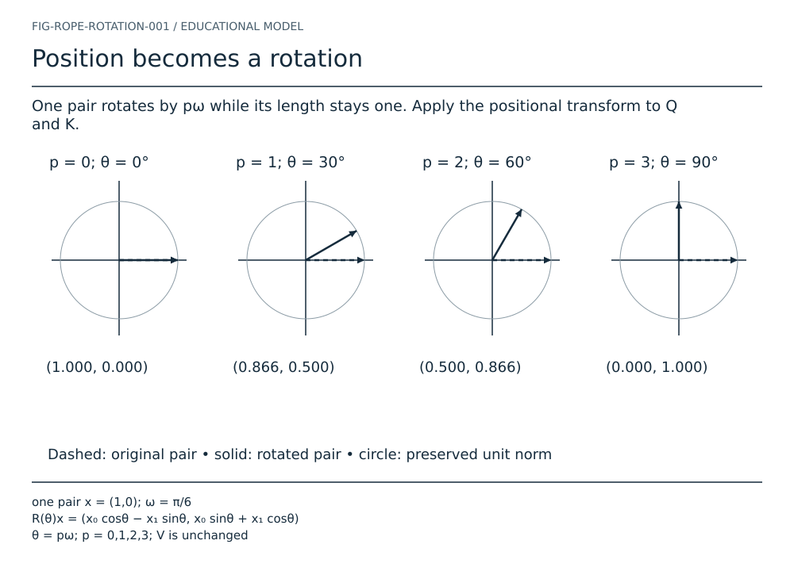
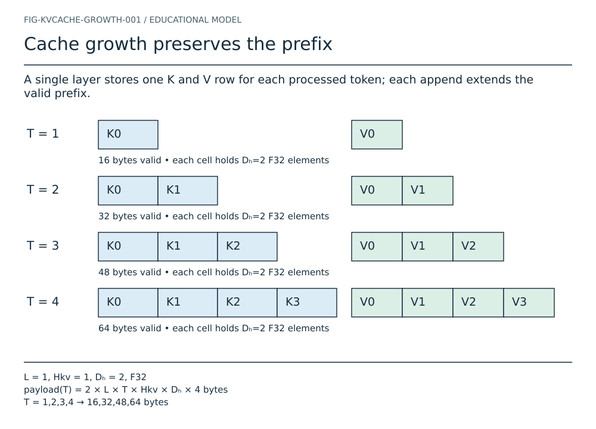
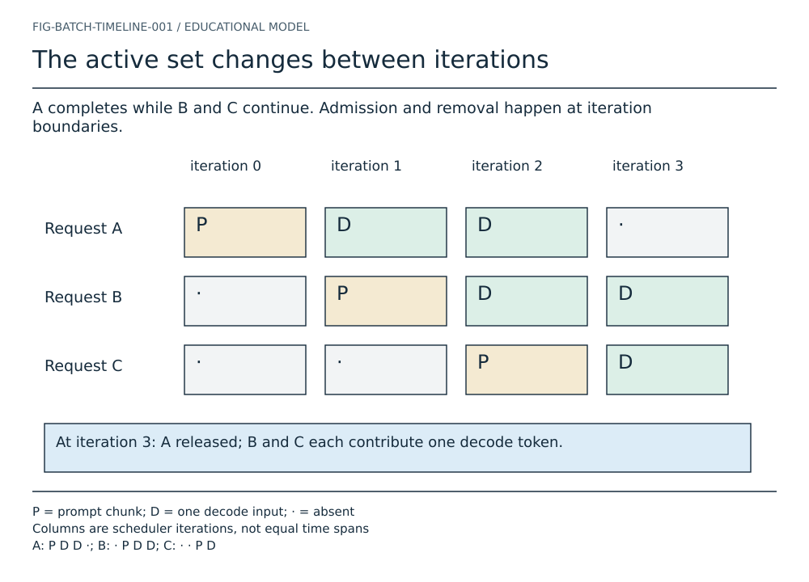

# LLM engine visual atlas

Ten prototype plates share one visual language and explicit evidence status.
The seven written chapters remain the current book; future mechanisms below
are educational specifications. See [visual language](VISUAL_LANGUAGE.md),
[storyboards](storyboards.md), and [build instructions](../docs/FIGURE_BUILD.md).

## A tensor is a map into storage

![Trace logical coordinate [1,2] to element 5 and byte 20. shape [2,3] • rank 2 • F32; strides [3,1] • base 0 • contiguous; offset(i,j) = 3i + j; byte = 4 × offset](generated/tensor.svg)

Trace logical coordinate [1,2] to element 5 and byte 20. shape [2,3] • rank 2 • F32. strides [3,1] • base 0 • contiguous. offset(i,j) = 3i + j; byte = 4 × offset.

[Semantic source](../figures/src/tensor.json) · [Text equivalent](generated/tensor.txt) · [Evidence](../code/mini-engine/crates/engine0/src/tensor.rs)

## One row becomes one output

![Match each reduction index, multiply, then accumulate in increasing index order. W [2,3] × x [3] = y [2]; row 0: 1×2 + 2×(-1) + 3×0.5 = 1.5; row 1: 4×2 + 5×(-1) + 6×0.5 = 6](generated/gemv.svg)

Match each reduction index, multiply, then accumulate in increasing index order. W [2,3] × x [3] = y [2]. row 0: 1×2 + 2×(-1) + 3×0.5 = 1.5. row 1: 4×2 + 5×(-1) + 6×0.5 = 6.

[Semantic source](../figures/src/gemv.json) · [Text equivalent](generated/gemv.txt) · [Evidence](../code/mini-engine/crates/engine0/src/linear.rs)

## From identity to three learned views

![Lookup copies a selected row; normalization rescales it; three projections produce distinct activations. E [3,4], token 1 selects x [4]; x̂ᵢ = xᵢwᵢ / √(Σⱼxⱼ²/4 + ε); Q [2,2], K [2,2], V [2,2]; no position yet](generated/pipeline.svg)

Lookup copies a selected row; normalization rescales it; three projections produce distinct activations. E [3,4], token 1 selects x [4]. x̂ᵢ = xᵢwᵢ / √(Σⱼxⱼ²/4 + ε). Q [2,2], K [2,2], V [2,2]; no position yet.

[Semantic source](../figures/src/pipeline.json) · [Text equivalent](generated/pipeline.txt) · [Evidence](../code/mini-engine/crates/engine0/src/normalization.rs)

## Heads regroup values without moving them

![A canonical flat vector [4] becomes [2,2]; head coordinates map to the same four elements. D = 4, H = 2, Dₕ = 2; offset(h,j) = h × 2 + j; No arithmetic, allocation or transpose is implied by this view](generated/heads.svg)

A canonical flat vector [4] becomes [2,2]; head coordinates map to the same four elements. D = 4, H = 2, Dₕ = 2. offset(h,j) = h × 2 + j. No arithmetic, allocation or transpose is implied by this view.

[Semantic source](../figures/src/heads.json) · [Text equivalent](generated/heads.txt) · [Evidence](../code/mini-engine/crates/engine0/src/tensor.rs)

## Position becomes a rotation

One pair rotates by pω while its length stays one. Apply the positional transform to Q and K. one pair x = (1,0); ω = π/6. R(θ)x = (x₀ cosθ − x₁ sinθ, x₀ sinθ + x₁ cosθ). θ = pω; p = 0,1,2,3; V is unchanged.

[Semantic source](../figures/src/rope.json) · [Text equivalent](generated/rope.txt) · [Evidence](../research/astra/source-map.md) · [Play the sequence](generated/rope.html)

## Compatibility becomes a weighted value

![One query scores two visible keys, normalizes scores and combines corresponding value rows. q [2], K [3,2], V [3,2]; query position t = 1; scores = Kq / √2; future position 2 is masked; α = softmax(scores + mask); output = Σⱼ αⱼVⱼ](generated/attention.svg)

One query scores two visible keys, normalizes scores and combines corresponding value rows. q [2], K [3,2], V [3,2]; query position t = 1. scores = Kq / √2; future position 2 is masked. α = softmax(scores + mask); output = Σⱼ αⱼVⱼ.

[Semantic source](../figures/src/attention.json) · [Text equivalent](generated/attention.txt) · [Evidence](../research/astra/source-map.md)

## Cache growth preserves the prefix

A single layer stores one K and V row for each processed token; each append extends the valid prefix. L = 1, Hkv = 1, Dₕ = 2, F32. payload(T) = 2 × L × T × Hkv × Dₕ × 4 bytes. T = 1,2,3,4 → 16,32,48,64 bytes.

[Semantic source](../figures/src/cache.json) · [Text equivalent](generated/cache.txt) · [Evidence](../research/astra/source-map.md) · [Play the sequence](generated/cache.html)

## The active set changes between iterations

A completes while B and C continue. Admission and removal happen at iteration boundaries. P = prompt chunk; D = one decode input; · = absent. Columns are scheduler iterations, not equal time spans. A: P D D ·; B: · P D D; C: · · P D.

[Semantic source](../figures/src/batch.json) · [Text equivalent](generated/batch.txt) · [Evidence](../research/astra/source-map.md) · [Play the sequence](generated/batch.html)

## One worker owns the context

Requests enter a queue; the worker builds a mixed batch, invokes decode, samples and streams results. CURRENT default path; simplified successful iteration. Worker owns Context and Batch; API does not call kernels directly. Error/cancel: finalize affected request; no later token emission.

[Semantic source](../figures/src/sequence.json) · [Text equivalent](generated/sequence.txt) · [Evidence](../research/astra/source-map.md)

## Follow data, decisions and persistent state

The default runtime reaches llama.cpp through a bridge. Optional providers execute backend kernels. CURRENT: API → Dispatcher → BatchedRuntime → llama.cpp. PREVIEW: paged runtime; LIBRARY: native components. Provider availability is build-dependent, not a performance claim.

[Semantic source](../figures/src/architecture.json) · [Text equivalent](generated/architecture.txt) · [Evidence](../research/astra/source-map.md)
