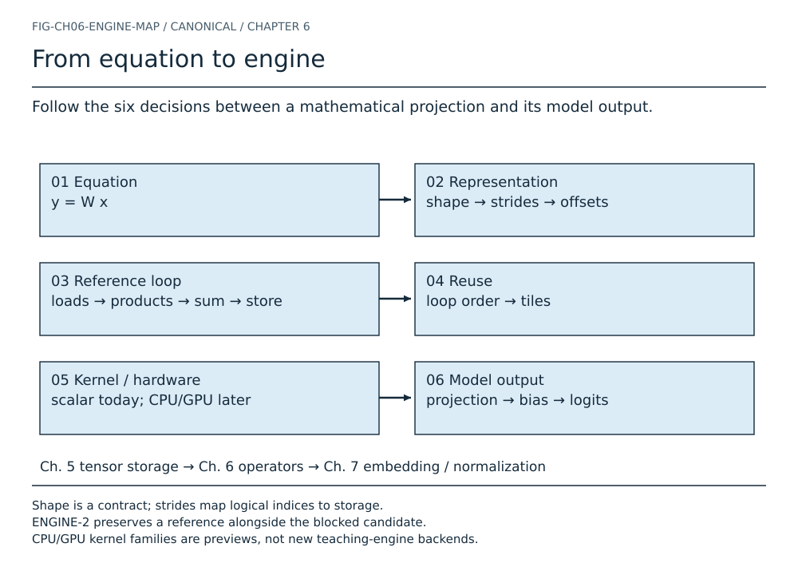
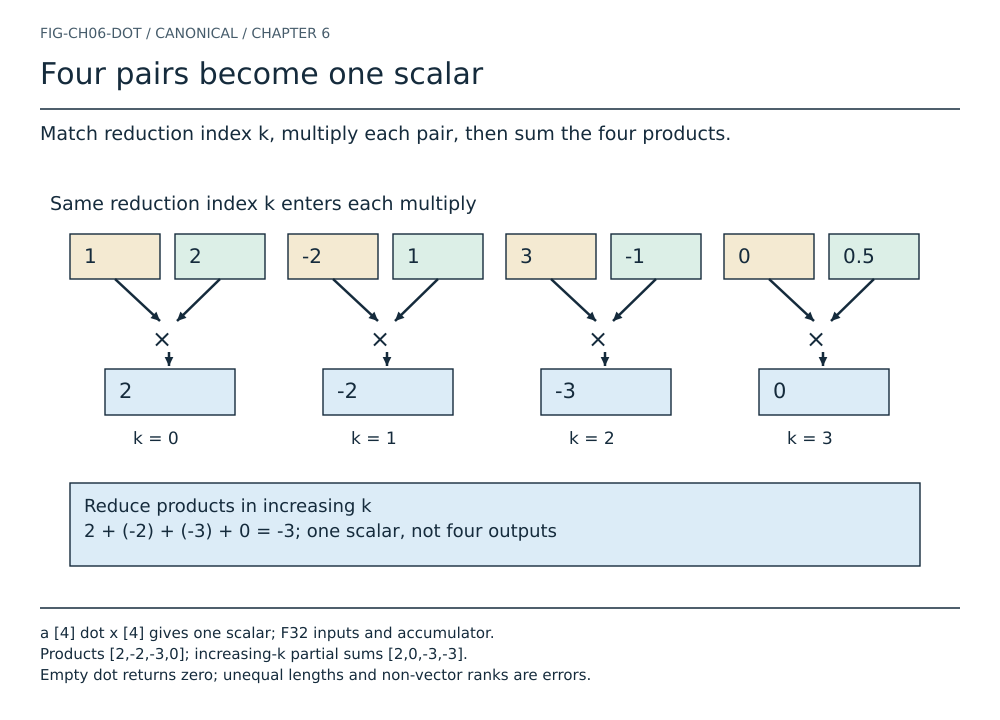
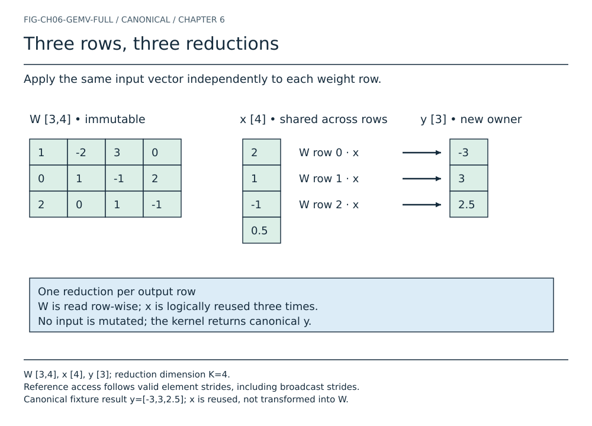
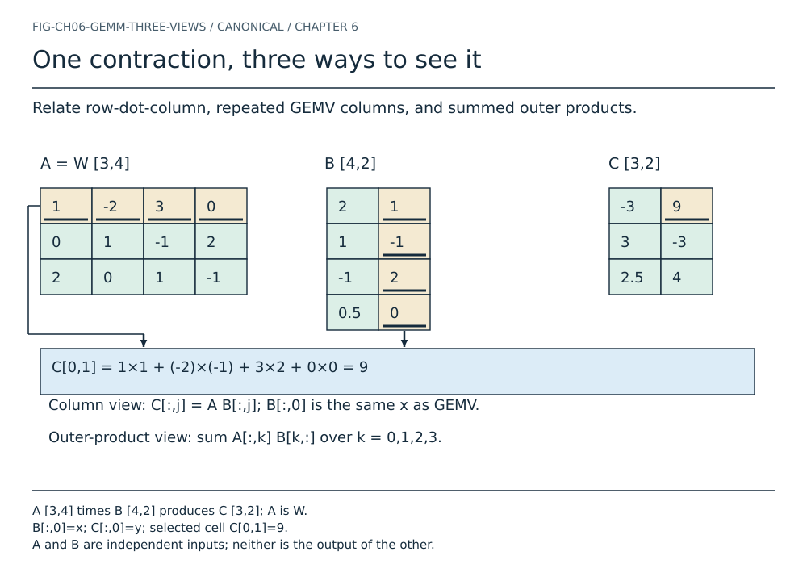
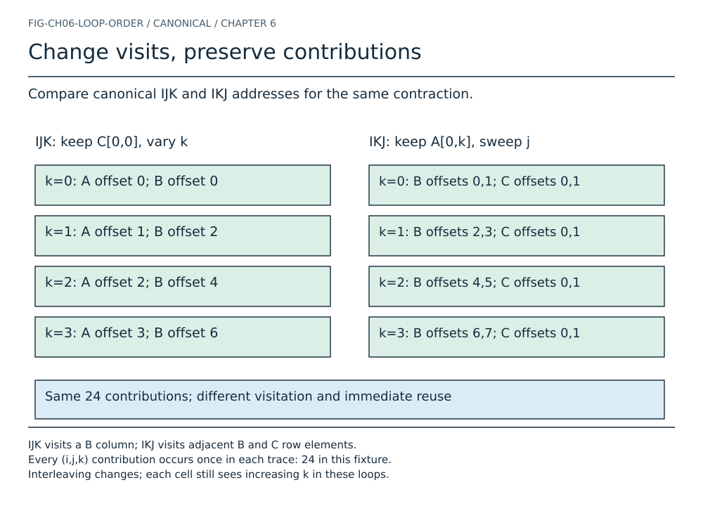
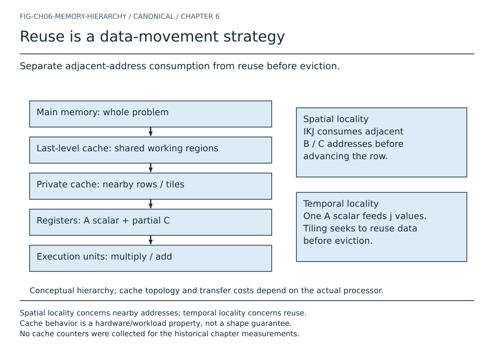
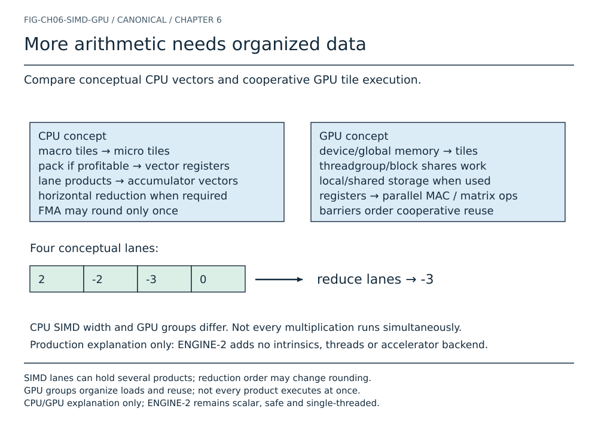
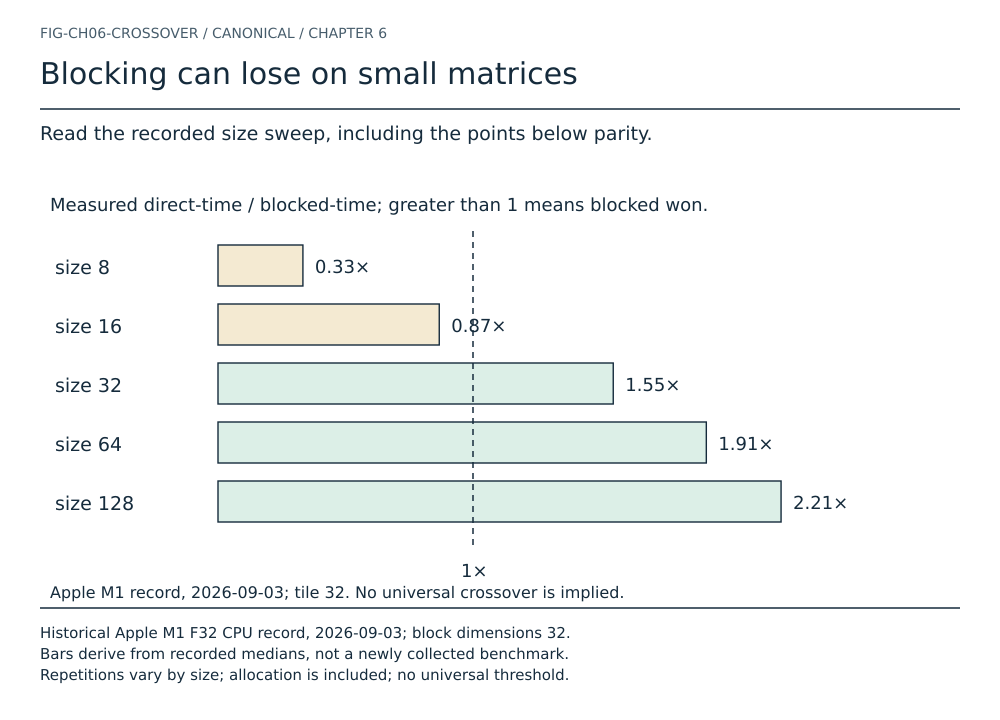
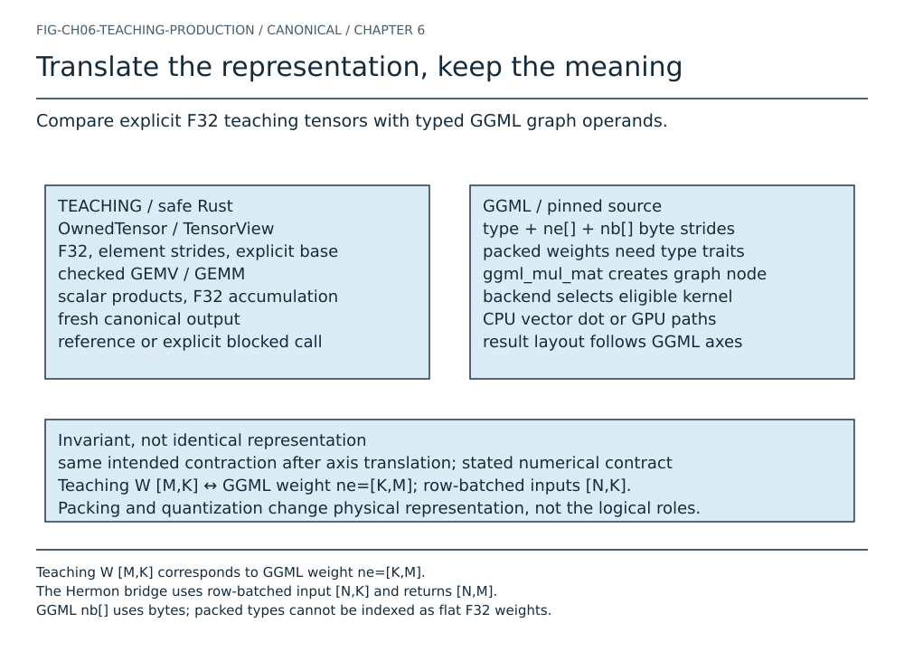
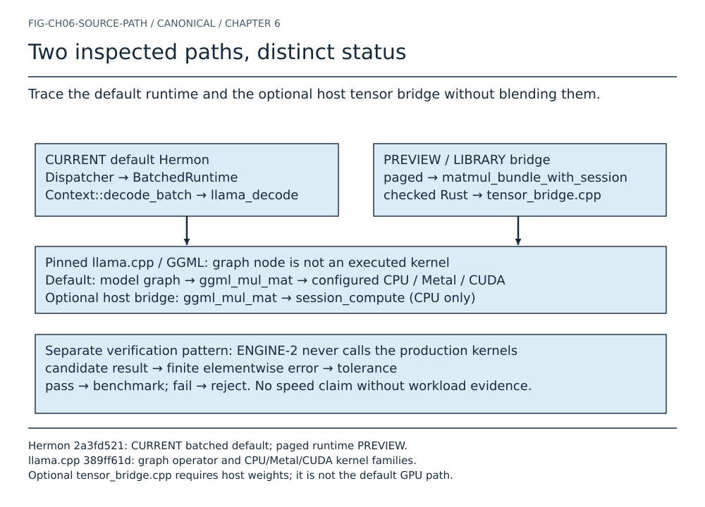

# Chapter 6 — Equation to kernel atlas

Fourteen canonical plates use one input-only fixture and a separately identified
tail stress case. Historical charts parse their original recorded medians.

## From equation to engine

Shape is a contract; strides map logical indices to storage. ENGINE-2 preserves a reference alongside the blocked candidate. CPU/GPU kernel families are previews, not new teaching-engine backends.

[Scene](src/ch06-engine.json) · [Text equivalent](generated/ch06-engine.txt)

## Four pairs become one scalar

a [4] dot x [4] gives one scalar; F32 inputs and accumulator. Products [2,-2,-3,0]; increasing-k partial sums [2,0,-3,-3]. Empty dot returns zero; unequal lengths and non-vector ranks are errors.

[Scene](src/ch06-dot.json) · [Text equivalent](generated/ch06-dot.txt)

## Watch one row accumulate

![ Four ordered updates produce y[0] from row 0 of W and the shared x. ](generated/ch06-row.svg)

W [3,4] times x [4] produces a fresh y [3]. The row-0 accumulator starts at zero and ends at -3. Read-only inputs; the output is stored after the reduction.

[Scene](src/ch06-row.json) · [Text equivalent](generated/ch06-row.txt) · [Step sequence](generated/ch06-row.html)

## Three rows, three reductions

W [3,4], x [4], y [3]; reduction dimension K=4. Reference access follows valid element strides, including broadcast strides. Canonical fixture result y=[-3,3,2.5]; x is reused, not transformed into W.

[Scene](src/ch06-gemv.json) · [Text equivalent](generated/ch06-gemv.txt)

## A multiplication begins with an address

![ Connect logical W[1,2] to its flat element and byte displacement. ](generated/ch06-memory.svg)

Canonical W shape [3,4], element strides [4,1], base offset 0. offset(1,2)=6; byte displacement 24; loaded value -1. For general views use base + sum(index times stride), not iK+k.

[Scene](src/ch06-memory.json) · [Text equivalent](generated/ch06-memory.txt)

## One contraction, three ways to see it

A [3,4] times B [4,2] produces C [3,2]; A is W. B[:,0]=x; C[:,0]=y; selected cell C[0,1]=9. A and B are independent inputs; neither is the output of the other.

[Scene](src/ch06-gemm.json) · [Text equivalent](generated/ch06-gemm.txt)

## Change visits, preserve contributions

IJK visits a B column; IKJ visits adjacent B and C row elements. Every (i,j,k) contribution occurs once in each trace: 24 in this fixture. Interleaving changes; each cell still sees increasing k in these loops.

[Scene](src/ch06-loops.json) · [Text equivalent](generated/ch06-loops.txt) · [Step sequence](generated/ch06-loops.html)

## A tail is a smaller valid tile

![ Follow edge regions in a rectangular [5,7] times [7,3] multiplication. ](generated/ch06-tiles.svg)

Block dimensions BM=4, BK=4, BN=2; ranges are half-open. Last tile i=4..5, k=4..7, j=2..3; no contribution is discarded. Bounds use saturating addition and min; blocked inputs must be canonical.

[Scene](src/ch06-tiles.json) · [Text equivalent](generated/ch06-tiles.txt)

## Reuse is a data-movement strategy

Spatial locality concerns nearby addresses; temporal locality concerns reuse. Cache behavior is a hardware/workload property, not a shape guarantee. No cache counters were collected for the historical chapter measurements.

[Scene](src/ch06-hierarchy.json) · [Text equivalent](generated/ch06-hierarchy.txt)

## More arithmetic needs organized data

SIMD lanes can hold several products; reduction order may change rounding. GPU groups organize loads and reuse; not every product executes at once. CPU/GPU explanation only; ENGINE-2 remains scalar, safe and single-threaded.

[Scene](src/ch06-hardware.json) · [Text equivalent](generated/ch06-hardware.txt)

## Blocking can lose on small matrices

Historical Apple M1 F32 CPU record, 2026-09-03; block dimensions 32. Bars derive from recorded medians, not a newly collected benchmark. Repetitions vary by size; allocation is included; no universal threshold.

[Scene](src/ch06-crossover.json) · [Text equivalent](generated/ch06-crossover.txt)

## Potential reuse is not attained throughput

![ Compare the recorded N=1,8,64 workloads with the same [512,512] weights. ](generated/ch06-throughput.svg)

Historical effective GFLOP/s: 2.739, 1.273, 5.397 respectively. Ideal arithmetic intensity is a traffic model, not measured memory traffic. N=8 is a retained negative result; overhead/cache causes remain hypotheses.

[Scene](src/ch06-throughput.json) · [Text equivalent](generated/ch06-throughput.txt)

## Translate the representation, keep the meaning

Teaching W [M,K] corresponds to GGML weight ne=[K,M]. The Hermon bridge uses row-batched input [N,K] and returns [N,M]. GGML nb[] uses bytes; packed types cannot be indexed as flat F32 weights.

[Scene](src/ch06-production.json) · [Text equivalent](generated/ch06-production.txt)

## Two inspected paths, distinct status

Hermon 2a3fd521: CURRENT batched default; paged runtime PREVIEW. llama.cpp 389ff61d: graph operator and CPU/Metal/CUDA kernel families. Optional tensor_bridge.cpp requires host weights; it is not the default GPU path.

[Scene](src/ch06-source.json) · [Text equivalent](generated/ch06-source.txt)
