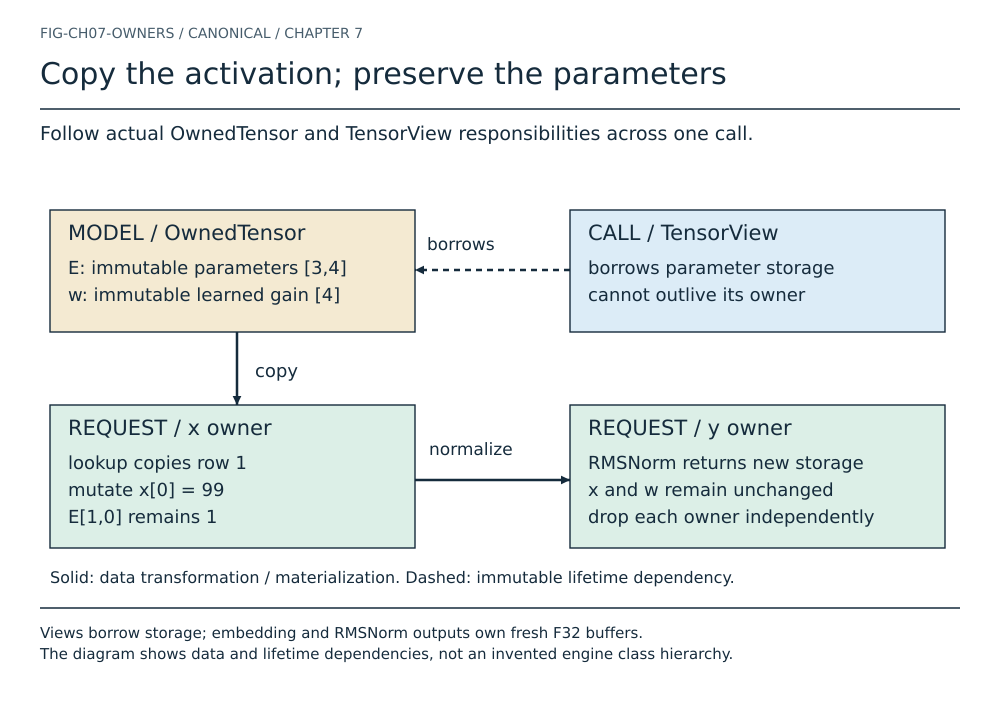
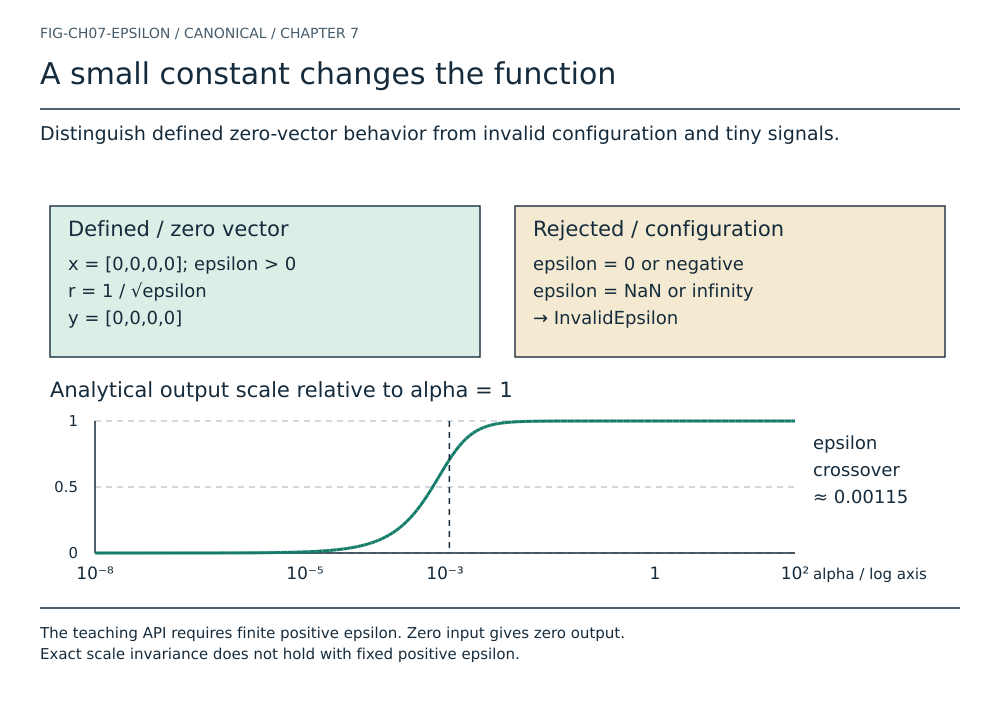
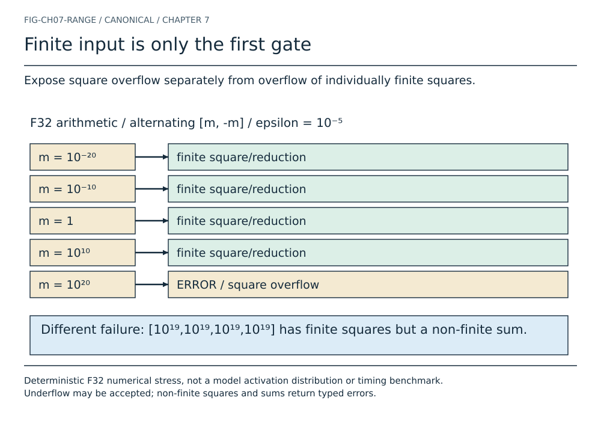
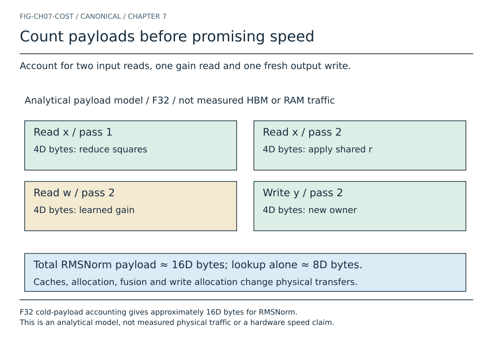
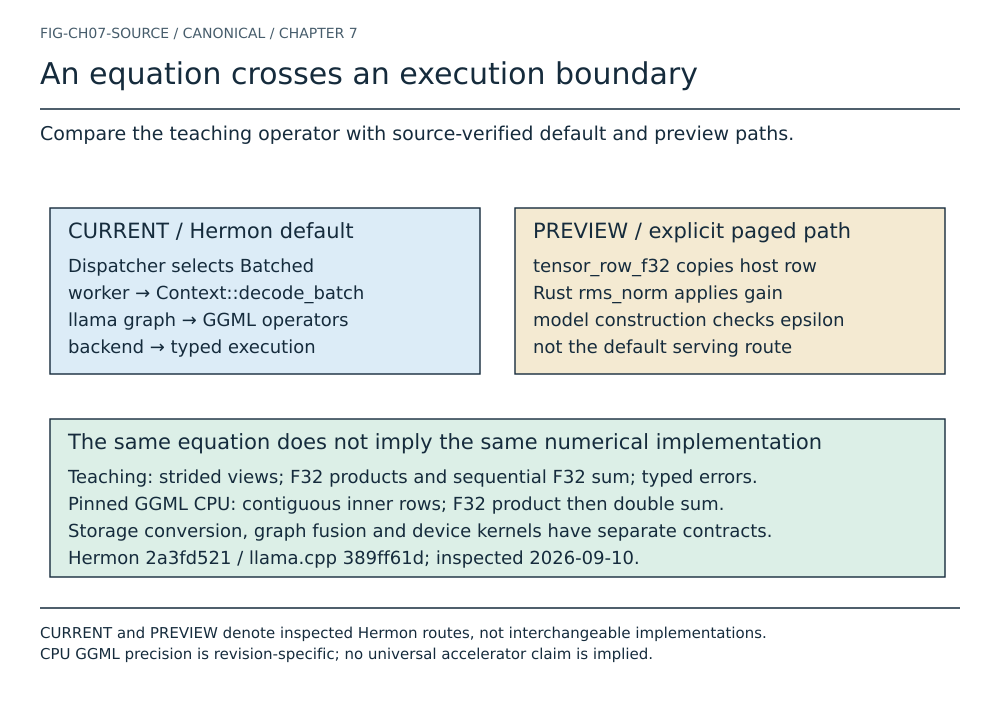

# Chapter 7 visual atlas

Ten canonical plates connect token identity, memory and two-pass normalization.
The fixture extends the existing hand vector without replacing historical tests.
Run `python3 scripts/check-normalization-visual-parity.py` from the repository root.

[Chapter](../manuscript/part-02/chapter-07-embeddings-and-normalization.md) · [Review](../research/astra/chapter07-regeneration.md)

## From a token identity to a numerical state

![Locate embedding and normalization between tokenization and learned projections. E [3,4] is model-owned; x [4] and y [4] are fresh activation owners. F32 teaching fixture; Q/K/V and attention remain outside this chapter.](generated/ch07-journey.svg)

Locate embedding and normalization between tokenization and learned projections. E [3,4] is model-owned; x [4] and y [4] are fresh activation owners. F32 teaching fixture; Q/K/V and attention remain outside this chapter.

[Semantic source](../figures/src/ch07-journey.json) · [Text version](generated/ch07-journey.txt)

## An ID selects a row, not a meaning

![Separate learned table capacity from the four values copied for one token. Canonical E [3,4], strides [4,1], F32; token 1 selects row 1. Element offsets [4,5,6,7] correspond to byte displacements [16,20,24,28].](generated/ch07-lookup.svg)

Separate learned table capacity from the four values copied for one token. Canonical E [3,4], strides [4,1], F32; token 1 selects row 1. Element offsets [4,5,6,7] correspond to byte displacements [16,20,24,28].

[Semantic source](../figures/src/ch07-lookup.json) · [Text version](generated/ch07-lookup.txt)

## Equal tokens do not share mutable activations

![Preserve token order and repetition when gathering a sequence into new storage. Tokens [1,0,1] produce canonical X [3,4] with strides [4,1]. Rows 0 and 2 have equal values, but mutating one cannot mutate the other.](generated/ch07-sequence.svg)

Preserve token order and repetition when gathering a sequence into new storage. Tokens [1,0,1] produce canonical X [3,4] with strides [4,1]. Rows 0 and 2 have equal values, but mutating one cannot mutate the other.

[Semantic source](../figures/src/ch07-sequence.json) · [Text version](generated/ch07-sequence.txt)

## Copy the activation; preserve the parameters

Follow actual OwnedTensor and TensorView responsibilities across one call. Views borrow storage; embedding and RMSNorm outputs own fresh F32 buffers. The diagram shows data and lifetime dependencies, not an invented engine class hierarchy.

[Semantic source](../figures/src/ch07-owners.json) · [Text version](generated/ch07-owners.txt)

## One reduction, then four output coordinates

![Follow every square and partial sum before broadcasting the reciprocal RMS. x [4] and learned w [4] are immutable; epsilon = 1e-5 is inside the root. Products, sums and output are F32; y [4] has canonical owned storage.](generated/ch07-passes.svg)

Follow every square and partial sum before broadcasting the reciprocal RMS. x [4] and learned w [4] are immutable; epsilon = 1e-5 is inside the root. Products, sums and output are F32; y [4] has canonical owned storage.

[Semantic source](../figures/src/ch07-passes.json) · [Text version](generated/ch07-passes.txt) · [Play sequence](generated/ch07-passes.html)

## A small constant changes the function

Distinguish defined zero-vector behavior from invalid configuration and tiny signals. The teaching API requires finite positive epsilon. Zero input gives zero output. Exact scale invariance does not hold with fixed positive epsilon.

[Semantic source](../figures/src/ch07-epsilon.json) · [Text version](generated/ch07-epsilon.txt)

## Finite input is only the first gate

Expose square overflow separately from overflow of individually finite squares. Deterministic F32 numerical stress, not a model activation distribution or timing benchmark. Underflow may be accepted; non-finite squares and sums return typed errors.

[Semantic source](../figures/src/ch07-range.json) · [Text version](generated/ch07-range.txt)

## Count payloads before promising speed

Account for two input reads, one gain read and one fresh output write. F32 cold-payload accounting gives approximately 16D bytes for RMSNorm. This is an analytical model, not measured physical traffic or a hardware speed claim.

[Semantic source](../figures/src/ch07-cost.json) · [Text version](generated/ch07-cost.txt)

## RMS normalization is not mean centering

![Use a uniform vector to expose the operation that LayerNorm performs and RMSNorm omits. Uniform x=[4,4,4,4], positive epsilon; both gains 1, LayerNorm bias 0. Mixed-sign fixture output RMS is about 1.342 after learned gain, not unity.](generated/ch07-contrast.svg)

Use a uniform vector to expose the operation that LayerNorm performs and RMSNorm omits. Uniform x=[4,4,4,4], positive epsilon; both gains 1, LayerNorm bias 0. Mixed-sign fixture output RMS is about 1.342 after learned gain, not unity.

[Semantic source](../figures/src/ch07-contrast.json) · [Text version](generated/ch07-contrast.txt)

## An equation crosses an execution boundary

Compare the teaching operator with source-verified default and preview paths. CURRENT and PREVIEW denote inspected Hermon routes, not interchangeable implementations. CPU GGML precision is revision-specific; no universal accelerator claim is implied.

[Semantic source](../figures/src/ch07-source.json) · [Text version](generated/ch07-source.txt)
