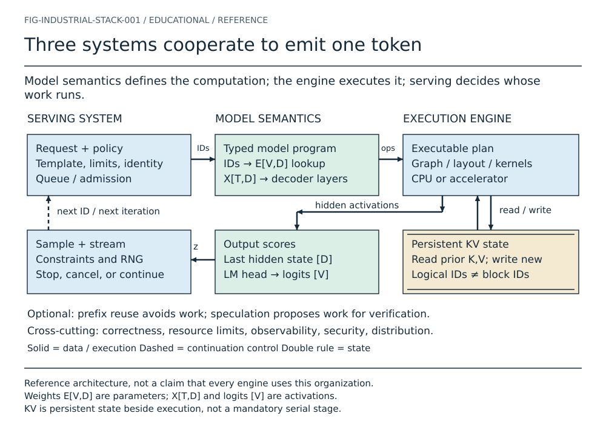
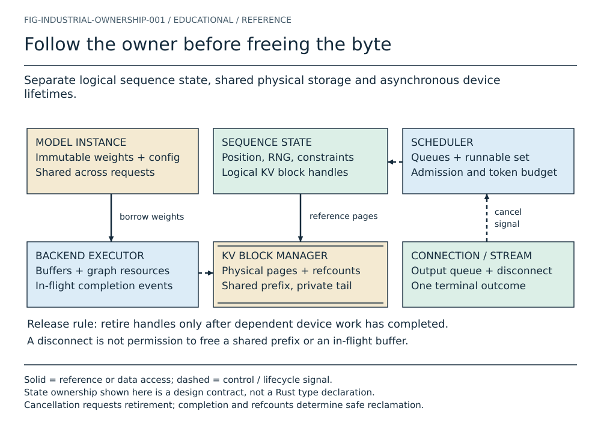
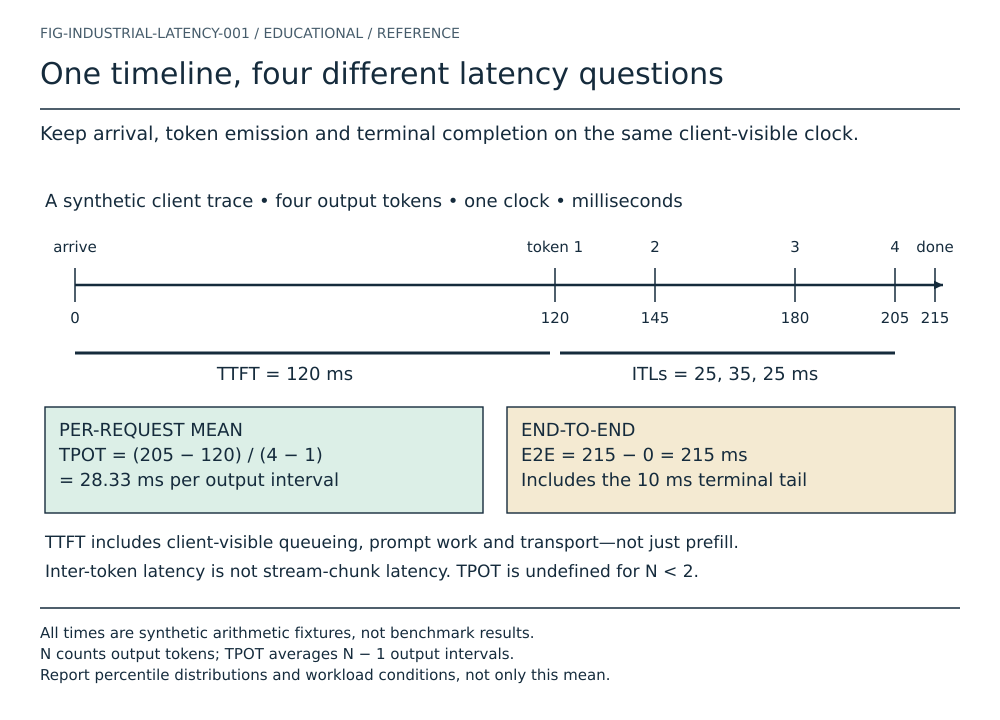
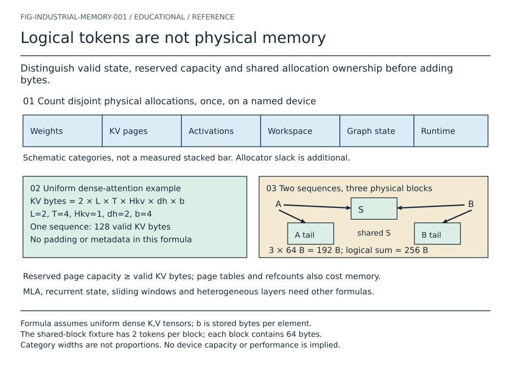

# Industrial inference: four reference plates

These editable SVG/Unicode TXT pairs explain relationships omitted by a linear
model-generation sketch. They are reference architecture and synthetic numerical
examples, not new mini-engine features. The [source ledger](../research/industrial-source-map.md)
states the evidence limits. Their scene sources are in `figures/src/industrial-*.json`;
the renderer and arithmetic contracts are in `figures/industrial.py`.

## 1. The model, the engine and the service

Figure I.1. The model defines operations; the engine implements them; serving
admits and schedules work. The output score vector feeds a sampler, whose chosen
token may schedule another iteration. KV state is read and extended during
execution. It is not a mandatory stage between attention and the output head.
[Text graph](generated/industrial-stack.txt).

The most important distinction is between **what a value means** and **how it
is produced**. The embedding table E[V,D] is a parameter array indexed by token
identity. The lookup output X[T,D] contains activations for this input. A fused
kernel may avoid materializing an intermediate that a mathematical explanation
names. That changes storage and execution, not the intended model function.
Likewise, a scheduler may combine work from several sequences while each sequence
retains its own causal history. Optional prefix reuse skips already valid work;
speculation proposes work that must be verified. Neither belongs in a compulsory
serial pipeline.

## 2. State ownership outlives the connection

Figure I.2. A logical sequence references physical pages managed separately.
Device work can outlive the host call that submitted it. A client disconnect
signals cancellation; it does not itself prove that a buffer is safe to free.
[Text graph](generated/industrial-ownership.txt).

Suppose two requests share a prefix. Their logical block lists both reference
the same physical prefix page. Cancelling request A should prevent its future
work, but it cannot invalidate request B's reference. Even A's private tail may
remain in use by an in-flight kernel. Safe reclamation therefore has two
conditions: all relevant work is complete and no live reference remains. The
diagram shows separate owners so a reader can identify which component proves
each condition. This is a reference design; a real runtime may combine these
roles in one worker without eliminating the obligations.

## 3. Timing must name its observation boundary

Figure I.3. Four synthetic output tokens arrive at 120, 145, 180 and 205 ms;
the request finishes at 215 ms. The first-token delay is 120 ms. The three
inter-token intervals are 25, 35 and 25 ms; their mean is 85/3 ms. Full latency
also includes the terminal tail. [Text graph](generated/industrial-latency.txt).

Let t0 be arrival, t1 the first output token, tN the last output token, and tf
terminal completion, all measured at the same boundary with one clock. Then
TTFT = t1 − t0, ITL(i) = ti − t(i−1), TPOT = (tN − t1)/(N−1) for N > 1,
and E2E = tf − t0. A one-token response has a valid TTFT but no output-to-output
interval; assigning it zero TPOT silently biases the average.

A network chunk can contain several tokens, or part of one decoded byte
sequence. Wire timing alone cannot recover token emission timestamps. If only
chunks are observable, report chunk latency explicitly. If separate client and
server clocks are used, report separate durations or a justified synchronization
method; do not subtract unrelated timestamps. Prompt processing, queueing,
transfer and output delivery may overlap across requests, so adding every stage
duration can double-count wall time.

The later performance curriculum must additionally define request length,
arrival process, concurrency, warmup, failures, percentile method and SLO.
Goodput counts useful work meeting the declared SLO—not every generated token
regardless of lateness, cancellation or validity. This plate supplies arithmetic,
not benchmark evidence.

## 4. Memory is an ownership ledger

Figure I.4. For one device, count disjoint physical allocations once. The dense
uniform example has 128 valid KV bytes per sequence. Two sequences sharing a
two-token prefix need three unique 64-byte blocks: 192 bytes, not the 256-byte
sum of their logical histories. [Text graph](generated/industrial-memory.txt).

For a uniform dense-attention layout, 2 × L × T × Hkv × dh × b counts K and V
across layers L, retained tokens T, KV heads Hkv, head width dh and stored bytes
per element b. Here L=2, T=4, Hkv=1, dh=2 and b=4. A two-token block therefore
holds 64 bytes across the two layers. Both requests reference one shared block
and one distinct private block. The physical allocation set contains three
blocks even though the logical reference lists contain four entries.

This count excludes page-table metadata, alignment, allocator slack and unused
reserved pages. Quantization scales can add storage beyond nominal payload bits.
Recurrent state, MLA, sliding windows and heterogeneous layers require different
terms; the dense formula is not a universal upper bound. Host and device copies
belong to their respective device ledgers. A buffer reused as workspace and
activation storage must not be counted twice as two simultaneous allocations.

## Full-pipeline animation storyboard — not implemented

| Frame | Reader question | Visible state change | Acceptance condition |
| --- | --- | --- | --- |
| 1 | What arrives? | Request identity, template and token IDs enter a bounded queue. | IDs are labelled illustrative or tied to a real tokenizer fixture. |
| 2 | Who runs? | Admission grants a work budget; a sequence becomes runnable. | A waiting request does not appear to execute. |
| 3 | What is computed? | Selected IDs produce typed activations and the engine executes a plan. | Weight storage and activation storage remain visually distinct. |
| 4 | What persists? | KV handles reference newly valid state; existing prefix stays unchanged. | Logical/physical distinction and any sharing are explicit. |
| 5 | What reaches the user? | Logits feed the declared sampler; incremental decoding emits bytes. | Token emission is not equated with a network chunk. |
| 6 | Why is there another iteration? | Next-token work re-enters scheduling, or terminal/cancel retires state. | Exactly one terminal outcome; no immediate free of live shared state. |

Optional zoom sequences will cover prefix hits, speculation rollback and
prefill/decode transfer. They must not be inserted as compulsory frames in every
request. Implement Play/Next/Previous/keyboard/reduced-motion only when the
underlying chapter fixture exists. Static SVG and TXT remain complete explanations.
