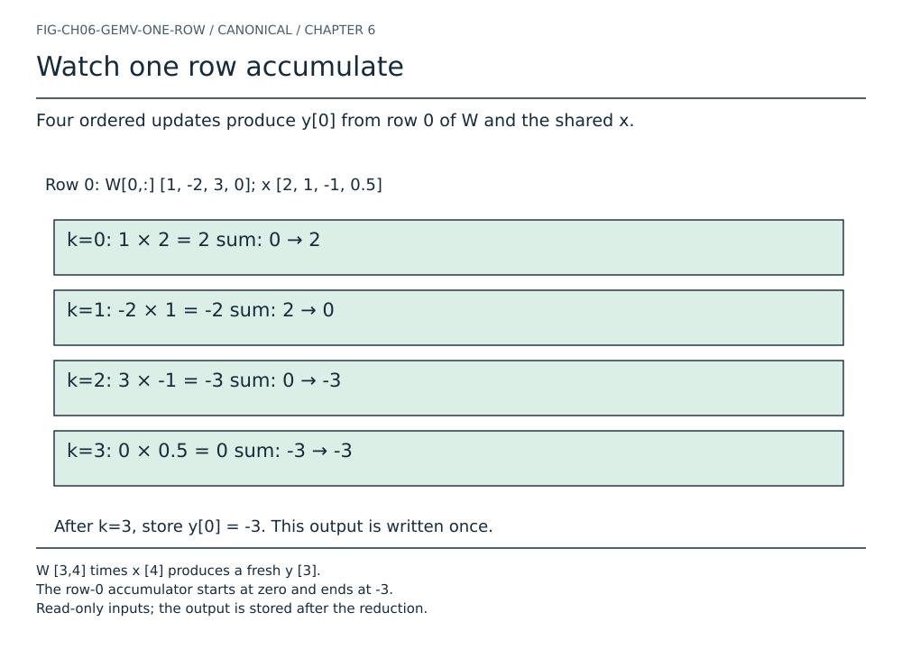
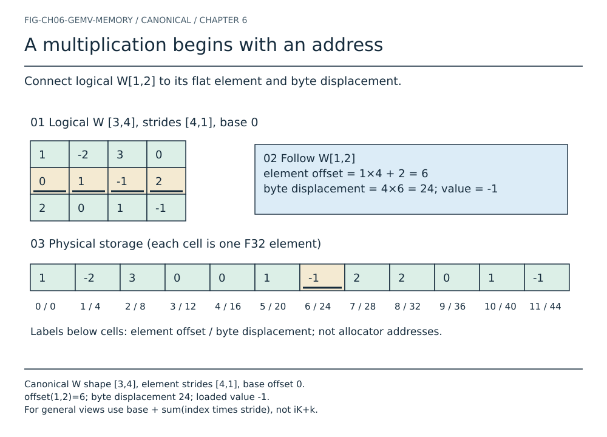
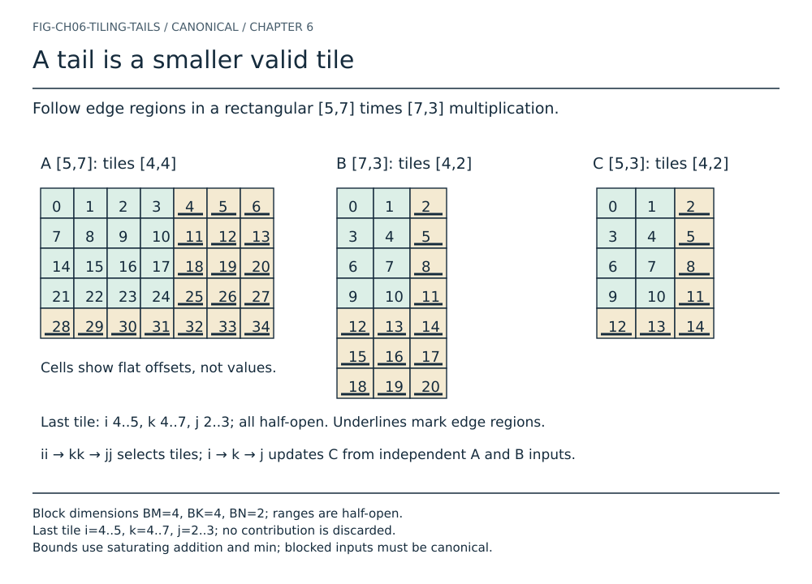
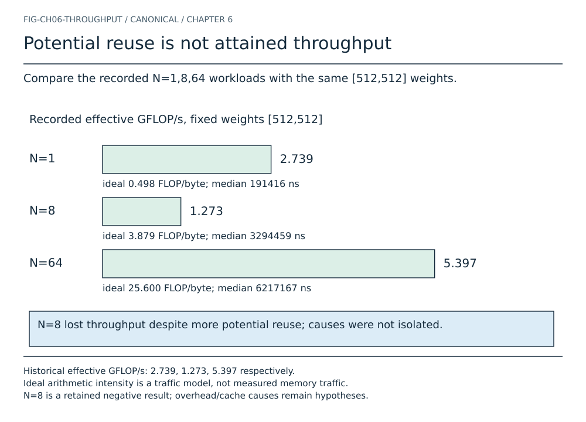

# Chapter 6 — Matrix Multiplication: The Engine Room

Chapter 5 gave tensor values addresses. Shape said which logical indices were
legal, strides mapped those indices to storage, and ownership said how long the
bytes remained alive. Yet an inference engine exists to *compute* with those
values. Its most familiar numerical operation is also one of its most
consequential systems problems: matrix multiplication.

A mathematical line such as $C=AB$ looks atomic. A processor does not receive
that line. It receives loads, multiplications, additions, stores, branches, and
addresses. The same mathematical products can be visited in different orders.
Those orders can move very different amounts of data through a memory
hierarchy, even when their operation counts are identical.

This chapter builds the book's first optimization cycle:

```text
specification ──▶ reference kernel ──▶ optimized substitution
      ▲                                         │
      └──────── equivalence proof ◀─────────────┘
                              │
                              ▼
                         measurement
```

The cycle matters more than the particular optimization. ENGINE-2 will contain
an obviously inspectable scalar reference path and a cache-blocked scalar CPU
path. It will keep both. The reference defines behavior for general valid
views; the blocked path accepts a narrower layout contract and must earn its
place with correctness gates and measurements.

> **FIRST PRINCIPLE**
> Matrix multiplication specifies which values contribute to an answer. A
> kernel specifies the order in which arithmetic and byte movement realize
> that answer.


Read this chapter in three passes: first determine **which values** contribute;
then trace **which addresses** the implementation visits; finally ask **what the
measurements justify**. A fast wrong answer fails the first pass. A plausible
cache story without timing evidence fails the third. The production comparison
at the end translates these same questions into Hermon and GGML, without adding
a production backend to the teaching engine.

## The most important loop in AI

Language-model inference repeatedly applies learned linear transformations.
Later chapters will add normalization, position handling, attention, and
feed-forward networks. Under many of those operators sit matrix-vector or
matrix-matrix products. They project activations from one feature space into
another; they also dominate large regions of weight storage and execution.

That importance does not make every product the same. During one-token decode,
a weight matrix may multiply one activation vector. During work over several
tokens or requests, the same weights may multiply several columns or rows of
activations. The equations are closely related, but their opportunity to reuse
each weight after loading it is different. Shape is therefore part of the
performance problem, not merely a type check.

ENGINE-1 already contained a linear projection:

$$
\mathbf{z}=\mathbf{W}\mathbf{h}+\mathbf{b},
$$

where $\mathbf{W}\in\mathbb{R}^{V_{\mathrm{vocab}}\times D}$,
$\mathbf{h}\in\mathbb{R}^{D}$,
$\mathbf{b}\in\mathbb{R}^{V_{\mathrm{vocab}}}$, and
$\mathbf{z}\in\mathbb{R}^{V_{\mathrm{vocab}}}$. The old implementation spelled the matrix-vector product as loops
inside the model. That was appropriate when the loop first made logits real.
It is now duplication. Chapter 6 extracts the numerical operation into a
kernel layer while leaving embedding lookup and bias addition as explicit
model operations.

## From multiply to multiply-accumulate

Begin with one multiplication. Given two `f32` values $a$ and $b$, their
product contributes $ab$ to some destination. A linear algebra kernel rarely
needs that product alone. It adds many products into an accumulator:

$$
s \leftarrow s + ab.
$$

This is a multiply-accumulate step. Hardware may later implement the expression
with a fused multiply-add instruction, which rounds once rather than rounding
the product and sum separately. ENGINE-2 does not select intrinsics or promise
fused behavior. Its source uses `f32` operands and an `f32` accumulator. The
independent oracle models separate `f32` rounding, while cross-path tests use an
explicit tolerance so compiler and architecture choices cannot masquerade as
semantic failure.

Follow one contribution in the canonical
[FLOP diagram](../../diagrams/linear/follow-the-flop.txt):

```text
 Aᵢₖ                  Bₖⱼ
  │                    │
  └──────────┬─────────┘
             ▼
        f32 multiply
             │
             ▼
 previous Cᵢⱼ ──▶ f32 add ──▶ next Cᵢⱼ
```

The floating-point representation makes the update bounded in precision, not
exact over real numbers; overflow can produce infinity. If large positive and negative contributions nearly cancel,
rounding error can be visible. If an optimized kernel changes the reduction
order, its final low bits may change as well.

## Dot product

For two vectors $\mathbf{a},\mathbf{b}\in\mathbb{R}^{K}$, the dot product is

$$
\mathbf{a}\cdot\mathbf{b}
=\sum_{k=0}^{K-1}a_kb_k.
$$

For the chapter's canonical example, take
$\mathbf{a}=[1,-2,3,0]$ and $\mathbf{x}=[2,1,-1,0.5]$:

$$
\mathbf{a}\cdot\mathbf{x}
=1(2)+(-2)(1)+3(-1)+0(0.5)
=2-2-3+0=-3.
$$


The two operands enter each multiplication independently. The product at index
2 is $3(-1)$, never $3(0.5)$: matching the reduction index is the operation's
identity. A visually pleasing crossing arrow that pairs the wrong indices
would teach a different computation.

The [multiply-accumulate diagram](../../diagrams/linear/dot-product-multiply-accumulate.txt)
shows the reduction visually. The shape contract is strict: both operands have
tensor rank 1 and the same length $K$. ENGINE-2 does not silently truncate to
the shorter length or broadcast one element.

When $K=0$, the loop has no terms. The sum is the additive identity, zero. This
is not a special numerical trick; it is the standard empty-sum convention and
makes zero-dimensional matrix products composable.

## Build it: scalar dot

The reference implementation is deliberately direct:

```rust
let mut sum = 0.0_f32;
for index in 0..left_len {
    sum += *left.get(&[index])? * *right.get(&[index])?;
}
```

Validation happens before the loop. `TensorView::get` then follows each
operand's logical indexing contract. A stride-2 vector and a zero-stride
read-only broadcast view are therefore valid. The kernel is not assuming that
logical neighbors occupy adjacent storage.

> **BUILD IT**
> Complete [Lab 22](../../labs/lab-22-dot-product.md). Expand the arithmetic,
> run `dot_reference`, then demand typed failures for bad rank and length.

This function is not meant to beat a tuned vector library. It gives later
kernels a legible semantic anchor: one reduction, ordered from index 0 through
$K-1$, into `f32`.

## Matrix times vector

Let $\mathbf{A}\in\mathbb{R}^{M\times K}$ and
$\mathbf{x}\in\mathbb{R}^{K}$. Their matrix-vector product
$\mathbf{y}=\mathbf{A}\mathbf{x}\in\mathbb{R}^{M}$ has one dot
product per matrix row:

$$
y_i=\sum_{k=0}^{K-1}A_{ik}x_k,
\qquad 0\le i<M.
$$

The shared $K$ dimension is contracted. The $M$ row dimension survives into
the output. The complete [GEMV shape diagram](../../diagrams/linear/gemv-shape-contract.txt)
makes that flow explicit.

Use one rectangular fixture throughout the numerical plates. We call the
weight matrix $W$ here and use $A=W$ when discussing generic GEMM:

$$
W=
\begin{bmatrix}
1&-2&3&0\\
0&1&-1&2\\
2&0&1&-1
\end{bmatrix},
\qquad
\mathbf{x}=
\begin{bmatrix}
2\\1\\-1\\0.5
\end{bmatrix},
$$

the first row produces

$$
y_0=1(2)+(-2)(1)+3(-1)+0(0.5)=-3,
$$

while the remaining rows produce

$$
\begin{aligned}
y_1&=0(2)+1(1)+(-1)(-1)+2(0.5)=3,\\
y_2&=2(2)+0(1)+1(-1)+(-1)(0.5)=2.5.
\end{aligned}
$$

Thus $\mathbf{y}=[-3,3,2.5]$. The rectangular matrix and mixed signs help expose
orientation errors that square, all-positive fixtures can conceal.



The partial sums are $2,0,-3,-3$, starting from zero before the first product.
The final zero product still occupies a legitimate reduction index. The
[step-through row animation](../../figures/generated/ch06-row.html) highlights
each update; this static plate contains every state and loses no information
in print. Nothing starts moving automatically.


## Build it: GEMV

`gemv_reference` accepts a rank-2 matrix view and a rank-1 vector view. It
validates $A.shape[1]=x.shape[0]$, allocates a new canonical `[M]`
`OwnedTensor`, and fills it with row dot products. Inputs remain immutable and
borrowed; output storage belongs to the caller.

The ownership choice is important. Returning a view into a temporary work
buffer would entangle result lifetime with kernel internals. Mutating an input
as an output would introduce aliasing questions. A fresh owner makes the v1
contract simple:

```text
 borrowed A ─┐
             ├──▶ GEMV ──▶ new OwnedTensor y
borrowed x ─┘
```

The numerical body is the existing kernel, not a diagram-only implementation:

```rust
for (row, value) in output.iter_mut().enumerate() {
    let mut sum = 0.0_f32;
    for k in 0..inner {
        sum += *matrix.get2(row, k)? * *vector.get(&[k])?;
    }
    *value = sum;
}
```

For shape `[M,0] × [0]`, the result is an owned `[M]` vector of zeros. For
`[0,K] × [K]`, it is an empty owner with shape `[0]`. No sentinel or fallback
path is needed.

> **BUILD IT**
> Complete [Lab 23](../../labs/lab-23-gemv-by-hand.md), including the strided
> fixture. Physical padding must not affect the logical result.

## From a weight coordinate to a loaded F32

Chapter 5's address contract remains active inside every multiply. For a valid
rank-2 view with element strides $s_0,s_1$ and base offset $o$,

$$
\operatorname{offset}_W(i,k)=o+i s_0+k s_1.
$$

Our canonical $W:[3,4]$ has strides `[4,1]` and base zero. Therefore
$W_{1,2}$ lives at element $1(4)+2=6$, whose displacement from the allocation's
start is $4(6)=24$ bytes for F32. The loaded value is $-1$. An element index,
a byte displacement, and the value at that location are three different things.



The reference calls checked view access; it does not replace that mapping with
`i*K+k` for arbitrary inputs. A transposed view changes strides without moving
values. A zero-stride immutable view may reuse one storage cell at several
logical positions. Both can be valid reference operands. The blocked kernel
later requires canonical row-major slices so its simplified arithmetic is
justified by an explicit boundary check, not by an assumption hidden in a loop.

The canonical [fixture](../../code/reference/fixtures/chapter06-visual.json)
stores inputs only. The independent
[Python visual oracle](../../code/reference/python/chapter06_visual_oracle.py)
derives outputs, addresses, contribution traces, and tile ranges. The
[Rust visual example](../../code/mini-engine/crates/engine0/examples/chapter06_visual_trace.rs)
uses the real tensor and linear APIs. A parity script compares the results;
neither a manually typed answer nor the artwork alone is the specification.

## Matrix times matrix

Let $\mathbf{A}\in\mathbb{R}^{M\times K}$ and
$\mathbf{B}\in\mathbb{R}^{K\times N}$. Their matrix product
$\mathbf{C}=\mathbf{A}\mathbf{B}\in\mathbb{R}^{M\times N}$ has elements

$$
C_{ij}=\sum_{k=0}^{K-1}A_{ik}B_{kj},
\qquad 0\le i<M,\quad 0\le j<N.
$$

Every output cell is the dot product of row $i$ from $A$ and column $j$ from
$B$. The inner dimensions must agree. There is no requirement that $M$, $K$,
and $N$ equal one another.

The two matrices are independent inputs to one contraction. An arrow from
$A$ into $B$ would incorrectly suggest that the first produces the second.

See the canonical [GEMM shape contract](../../diagrams/linear/gemm-shape-contract.txt)
and [one-output-cell diagram](../../diagrams/linear/gemm-one-output-cell.txt).
The common acronym **GEMM** comes from the BLAS general matrix-matrix family;
**GEMV** names the corresponding matrix-vector family. ENGINE-2 implements a
much smaller contract than full BLAS: no transpose flags, scaling parameters,
mixed layouts, or in-place accumulation into caller storage.

## Shape contracts are execution contracts

The symbols $M$, $K$, and $N$ are not decorative labels. They control loop
bounds, allocation size, and address arithmetic. Each dimension has a role:

- $M$ counts independent rows of the left operand and output;
- $K$ counts contributions reduced into each output value;
- $N$ counts columns of the right operand and output.

The agreement rule is positional. For $A:[M,K]$ and $B:[K,N]$, the last axis of
$A$ equals the first axis of $B$. Equal total element counts are irrelevant.
Shapes `[2,6]` and `[3,4]` both contain twelve values, but they cannot occupy
the two sides of this product because 6 does not equal 3. Reshaping one operand
would change the mathematical problem and must be an explicit caller action.

The dimension roles also explain orientation. ENGINE-1 stores projection
weights as `[vocabulary, hidden]`. Vocabulary candidates are output rows, so
$M=V$ and $K=D$. Multiplying by hidden `[D]` naturally returns `[V]`. If the
weights were stored `[D,V]`, the call would require a transpose view or a
different contract. A kernel must never guess orientation from equal numbers.

Shape validation precedes output allocation for two reasons. First, it avoids
spending memory on a computation that has no defined result. Second, it keeps
failure deterministic: an inner-dimension mismatch remains that typed error
rather than sometimes becoming allocation failure first. Output element count
$MN$ is checked independently because valid input views with empty K can still
describe an unrepresentably large prospective output.

Ranks are checked before individual axes are read. `gemv_reference` cannot
interpret a rank-2 shape as a vector merely because it contains one column;
`matmul_reference` cannot flatten a higher-rank tensor. Later engines will
define batching explicitly. Treating extra axes as implicit batches here would
create a second, undocumented operator.

This strictness makes error messages part of the kernel API. `RankMismatch`
names the operation and operand. `InnerDimensionMismatch` reports both K
values. `OutputShapeOverflow` reports M and N. Callers can diagnose which
contract failed without reconstructing it from a generic bounds error.

## One output cell by hand

Keep $A=W$ from GEMV, and place two input vectors into the columns of $B$:

$$
B=
\begin{bmatrix}
2&1\\
1&-1\\
-1&2\\
0.5&0
\end{bmatrix}.
$$

The selected output cell follows row 0 and column 1, matching the same $k$:

$$
C_{01}=1(1)+(-2)(-1)+3(2)+0(0)=9.
$$

Therefore

$$
C=
\begin{bmatrix}
-3&9\\
3&-3\\
2.5&4
\end{bmatrix}.
$$


The same contraction has two other useful interpretations. First, each column
of $B$ is a GEMV input:

$$
C_{:,j}=A B_{:,j},\qquad B_{:,0}=\mathbf{x},\qquad C_{:,0}=\mathbf{y}.
$$

Second, one reduction index contributes a whole rank-one matrix:

$$
C=\sum_{k=0}^{K-1} A_{:,k}B_{k,:}.
$$

Here $A_{:,k}$ is a column of length $M$ and $B_{k,:}$ a row of length $N$;
their outer product has shape `[M,N]`. For $k=0$, the contribution is
$[1,0,2]^{\mathsf T}[2,1]$, giving rows `[2,1]`, `[0,0]`, `[4,2]`.
Adding all four outer products yields the same $C$. Row-dot-column explains a
cell, repeated GEMV explains columns, and outer products explain reuse across
cells. None changes the mathematical result over real numbers.

Tracing all six cells matters. A test that checks only $C_{00}$ can miss a
wrong output-row stride. A square-only test can let code confuse $K$ with $N$
without crossing a bound. ENGINE-2 includes asymmetric fixtures and a grid of
rectangular shapes for exactly this reason.

## Build it: reference GEMM

The reference algorithm mirrors the equation:

```rust
for i in 0..rows {
    for j in 0..columns {
        let mut sum = 0.0_f32;
        for k in 0..inner {
            sum += *left.get2(i, k)? * *right.get2(k, j)?;
        }
        output[i * columns + j] = sum;
    }
}
```

Calling this loop *reference* is more precise than dismissing it as merely
naive. It prioritizes correspondence with the mathematical specification and
uses checked logical access. That makes it useful for review, unusual strides,
and differential testing. It is intentionally not the performance endpoint.

The output allocation is checked before numerical work. A result shape
`[M,N]` whose element count overflows `usize` returns
`OutputShapeOverflow`. Valid zero cases remain defined:

- `[M,0] × [0,N]` returns `[M,N]` filled with zeros;
- `[0,K] × [K,N]` returns an empty `[0,N]` owner;
- `[M,K] × [K,0]` returns an empty `[M,0]` owner.

The implementation checks representability, but ordinary `Vec` allocation can
still fail under genuine memory exhaustion. Rust's standard global allocator
behavior is outside this small API's recoverable error model; the distinction
between arithmetic overflow and resource exhaustion must remain explicit.

> **BUILD IT**
> Complete [Lab 24](../../labs/lab-24-gemm-by-hand.md). Check every cell and
> then use a transpose view to prove the reference path follows strides.

## How much arithmetic?

There are $MN$ output cells and $K$ multiply-accumulate contributions per
cell. Counting one multiplication and one addition as two floating-point
operations gives approximately

$$
F_{\mathrm{GEMM}}\approx2MKN\quad[\mathrm{FLOPs}].
$$

If one counts the first assignment differently, the exact addition count is
$MN(K-1)$ for nonempty $K$, while the multiply count is $MNK$. The conventional
$2MKN$ expression is a useful performance model, not a statement that every
compiler emits exactly that many instructions.

For GEMV,

$$
F_{\mathrm{GEMV}}\approx2MK\quad[\mathrm{FLOPs}].
$$

**FLOP** names an amount of floating-point work. **FLOP/s** names a rate. An
observed effective rate based on elapsed time $t$ seconds is

$$
P_{\mathrm{effective}}
\approx\frac{2MKN}{t}\quad[\mathrm{FLOP/s}].
$$

The benchmark reports GFLOP/s by dividing that rate by $10^9$. It does not
claim those operations correspond one-for-one to retired hardware
instructions.

## Why equal FLOPs do not mean equal time

Two loop nests can compute the same $2MKN$ model and take different times. The
processor must obtain operands before multiplying them and retain or reload
partial outputs before adding. Arithmetic units are only one resource among
caches, load/store units, memory channels, address-generation machinery, and
front-end control.

Chapter 5 measured a simpler clue on this same Apple M1. Traversing one
`[2048,2048]` allocation in row-major order had a 4,163,875 ns median; visiting
the same values column-wise had a 13,692,583 ns median. That experiment was not
GEMM and cannot prove a matrix-kernel ratio. It established a narrower fact:
access order can matter even when the values and arithmetic are held constant.
Chapter 6 therefore measures the matrix loops directly.

## Follow the operand

In canonical row-major storage, flat offsets are

$$
\operatorname{offset}_A(i,k)=iK+k,
$$

$$
\operatorname{offset}_B(k,j)=kN+j,
$$

and

$$
\operatorname{offset}_C(i,j)=iN+j.
$$

For fixed $i$ and $j$, the reference `i,j,k` loop increments $k$. Consecutive
$A_{ik}$ values have adjacent offsets. Consecutive $B_{kj}$ values are $N$
elements apart because the loop walks down one logical column of row-major
$B$. The [row-major access diagram](../../diagrams/linear/row-major-access.txt)
contrasts those movements.

The arithmetic is symmetric in the pair of operands; their memory walks are
not. When $N$ is large, asking the innermost loop to step by $N$ can underuse
each fetched cache line. The machine may retrieve neighboring $B$ values that
this particular inner loop does not immediately consume.

## Spatial and temporal locality

**Spatial locality** means accessing nearby addresses close together in time.
A cache line normally transfers several adjacent values, so a stride-1 walk can
use more of the transferred line. **Temporal locality** means reusing the same
value or region before it leaves a fast level of the memory hierarchy.

These are tendencies, not commands to hardware. Prefetchers, cache mapping,
compiler transformations, matrix dimensions, and competing work affect the
outcome. Still, they give us a productive question: can a legal loop
permutation make the intended reuse easier to realize?

## Working set and the memory hierarchy


A processor does not generally load every scalar directly from main memory on
every use. Registers sit closest to arithmetic. Several cache levels retain
recently accessed lines. Main memory is larger and usually more expensive to
reach. Exact capacities, policies, and latencies are architecture-specific,
but the hierarchy creates a general objective: arrange work so values are
reused while they remain in a faster level.

The **working set** is the data actively needed during a region of execution.
For one output cell in `ijk`, the conceptual set includes an A row, a B column,
and one accumulator. The A row has a contiguous walk, but the B column touches
many separated cache lines when N is large. Across adjacent output columns,
the algorithm revisits the same A row, yet whether it remains resident depends
on the rest of the active footprint.

In `ikj`, one $A_{ik}$ scalar is loaded into a local variable and reused across
an output row. The active B row and C row are contiguous. This does not ensure
that an entire long row fits a particular cache, but it exposes short-range
spatial reuse to the hardware and compiler.

Blocking shrinks that focus again. Instead of streaming complete rows while
other operands compete for capacity, it asks the machine to revisit bounded A,
B, and C regions. A useful tile lets multiple arithmetic contributions occur
per line fetched from a lower level. A bad tile can be too large to retain,
too small to amortize control, or poorly shaped for the matrix.

Cache lines also explain why counting logical scalar loads in source is not a
traffic measurement. Loading one `f32` can bring neighboring values. A later
access may hit that line without another main-memory transfer, or the line may
have been evicted and fetched again. The minimum-byte equations describe data
that must logically participate; only appropriate performance counters and a
defined hierarchy boundary could establish physical bytes.

This distinction prevents a common reasoning error. We may say `ikj` presents
contiguous B access and that blocking is designed to increase temporal reuse.
We may not say exactly how many cache misses it removes on the recorded host,
because the current benchmark records elapsed time rather than cache events.

There are six permutations of three distinct loop indices:

```text
ijk   ikj   jik   jki   kij   kji
```

Not all can use a single scalar accumulator in the same way, and their access
patterns differ under row-major layout. ENGINE-2 studies `ijk` and `ikj` rather
than pretending to rank all six universally.

## The `ikj` rewrite

The update equation can be written as

$$
C_{ij}\mathrel{+}=A_{ik}B_{kj}.
$$

For a fixed $i$ and $k$, let $j$ vary through a row segment:

```rust
for i in 0..m {
    for k in 0..inner {
        let left_value = left[i * inner + k];
        for j in 0..n {
            output[i * n + j] += left_value * right[k * n + j];
        }
    }
}
```

Now the innermost loop walks adjacent $B_{kj}$ and $C_{ij}$ positions. One
loaded $A_{ik}$ scalar feeds an entire output-row segment. The canonical
[loop-order diagram](../../diagrams/linear/loop-order-ijk-vs-ikj.txt) and
[reuse diagram](../../diagrams/linear/follow-the-reuse.txt) show this change.

Initialization moved too. `ijk` can compute one local sum and assign a cell.
`ikj` accumulates into many cells across K iterations, so the output must be
zero-initialized before the loop. Forgetting that step produces dependence on
old storage rather than matrix multiplication.

> **PERFORMANCE LAB**
> [Lab 25](../../labs/lab-25-loop-order.md) begins with physical offset
> sequences, not a stopwatch. Correctness is the admission ticket to timing.

## Performance lab: loop order


For the fixture, canonical strides are `A:[4,1]`, `B:[2,1]`, `C:[2,1]`.
At `i=0,j=0`, IJK reads B offsets `0,2,4,6`; IKJ at `i=0,k=0` reads
offsets `0,1` and updates C offsets `0,1` using the same A scalar. The
[loop-order animation](../../figures/generated/ch06-loops.html) advances $k$;
its static plate shows all four states. The parity gate verifies that the full
IJK and IKJ traces contain the identical set of 24 `(i,j,k)` contributions.
This proves traversal coverage, not a cache-hit count or a speedup.

The release harness compares direct scalar row-major `ijk` and `ikj` loops.
Both allocate and zero their result, use deterministic `f32` inputs, and pass a
per-element correctness gate. On the recorded Apple M1 run at code commit
`03e08a87` (full pin in the record), median results were:

| Square size | Repetitions | `ijk` | `ikj` | Observed ratio |
| ---: | ---: | ---: | ---: | ---: |
| 64 | 15 | 185,375 ns | 54,791 ns | 3.38× |
| 128 | 9 | 1,645,000 ns | 286,375 ns | 5.74× |
| 256 | 5 | 15,638,708 ns | 1,709,000 ns | 9.15× |

The exact environment, command, raw checksums, compiler, and limitations live
in the [loop-order benchmark record](../../research/benchmarks/chapter-06-loop-order.md).
For these tested shapes, `ikj` had the lower median. The widening ratio is
consistent with its contiguous inner walks; it is not a portable law or a
substitute for hardware-counter evidence.

## What the benchmark does—and does not—measure

The Chapter 6 harness uses `std::time::Instant` in a Cargo release build. Inputs
are deterministically generated before timing. Every candidate is executed
once for correctness before samples are accepted. Timed output is consumed
through a checksum and `black_box`, reducing the chance that an optimizing
compiler discards the work. Samples are sorted and the median is reported.

Median is a defensible summary for this bounded, exploratory microbenchmark,
but it does not describe tail latency or serving variability. Repetition
counts appear beside every result. Small shapes use more repetitions because
each sample is short; larger shapes use fewer to keep the exercise practical.
The process is warm, but cache contents are not flushed or controlled between
samples. Candidate order is stable rather than randomized. Frequency,
temperature, operating-system activity, and compiler-generated instructions
are not independently measured.

Allocation and zero-initialization are included. That matches the current
public API, which returns a fresh `OwnedTensor`, and prevents a prepared-output
control from receiving a hidden advantage. It also means the record cannot
attribute every nanosecond to arithmetic or cache traversal. A future reusable
output API would require a separate experiment with equivalent initialization
policy.

The harness's direct `ijk` and `ikj` functions use canonical flat slices after
their deterministic construction. Timing `matmul_reference` itself would also
include a checked logical view lookup for every operand access, confounding the
loop-order question with repeated boundary validation. Correctness still uses
the public contracts; the loop-order experiment isolates the two flat scalar
traversals. The blocked experiments time the actual public blocked kernel,
including its metadata views and layout checks.

Effective GFLOP/s divides the conventional work estimate by elapsed time. It
is useful for comparing shapes inside this record, but it is not measured peak
hardware throughput. The ideal FLOP/byte column divides work by compulsory
logical payload, not hardware counters. Publishing both without these labels
would create precision without accuracy.

Finally, the benchmark is not an inference benchmark. It has no tokenizer,
request queue, model file, KV cache, sampling, streaming, concurrency, or token
latency. Its purpose is narrower: make one kernel hypothesis reproducible. End-
to-end claims require end-to-end workloads and cannot be obtained by
multiplying independent microbenchmark ratios.

## Memory movement

A simplistic implementation might reload $A_{ik}$ and $B_{kj}$ for every
mathematical contribution, then repeatedly read and write $C_{ij}$. Caches can
remove some transfers to lower memory levels, but only if the active data stays
resident and the access order exposes reuse.

The smallest compulsory payload model for canonical `f32` GEMM reads each
input once and writes each output once:

$$
Q_{\min}=4(MK+KN+MN)\quad[\mathrm{bytes}].
$$

This is a lower-bound model, not measured traffic. Write allocation, eviction,
cache-line granularity, repeated loads, and metadata can increase physical
movement. The [byte-flow diagram](../../diagrams/linear/follow-the-byte.txt)
keeps the ownership and transfer story separate from the formula.

## Arithmetic intensity

**Arithmetic intensity** is floating-point work divided by bytes moved at a
chosen memory boundary:

$$
I=\frac{F}{Q}\quad[\mathrm{FLOP/byte}].
$$

Using the compulsory-payload model for GEMM gives

$$
I_{\mathrm{ideal}}
\approx\frac{2MKN}{4(MK+KN+MN)}\quad[\mathrm{FLOP/byte}].
$$

The word *ideal* is essential. Without hardware counters, ENGINE-2 does not
know actual cache or DRAM traffic.

For GEMV with $A:[M,K]$, $x:[K]$, and $y:[M]$, the analogous model is

$$
I_{\mathrm{GEMV,ideal}}
\approx\frac{2MK}{4(MK+K+M)}\quad[\mathrm{FLOP/byte}].
$$

For large $M$ and $K$, the $MK$ weight term dominates, so intensity approaches
approximately $0.5$ FLOP/byte. One weight contributes to one output vector.
In GEMM, a weight can contribute across $N$ columns, so potential reuse and
ideal intensity grow with $N$.

### Future connection: prefill and decode

Later chapters will distinguish two inference workload phases. **Prefill**
processes many prompt positions and can present matrix-like collections of
activations. **Decode** advances one or a few new positions per active sequence
and can present vector-like or skinny-matrix work. That suggests a useful first
intuition:

```text
                         LLM inference
                              │
                ┌─────────────┴─────────────┐
                ▼                           ▼
         prefill preview              decode preview
       many token states            one/few new states
          GEMM-like                GEMV/skinny-GEMM-like
       more reuse chances          less reuse per weight
```

This is explicitly a conceptual preview, not a complete workload model.
Attention shapes, batching, KV state, quantization, providers, and scheduling
will refine it. A production runtime may also batch decode work from several
requests into a matrix. Chapter 6 establishes only the numerical reason that
the number of activation columns can change weight-reuse opportunity.

## The Roofline mental model

The Roofline model relates attainable performance to peak compute, memory
bandwidth, and arithmetic intensity:

$$
P\le\min\left(P_{\mathrm{peak}},\ B_{\mathrm{memory}}I\right).
$$

At low intensity, the sloped bandwidth term can be the tighter ceiling. At
high intensity, the horizontal compute ceiling can dominate. The canonical
[Roofline concept diagram](../../diagrams/linear/roofline-concept.txt) is a
mental model, not a calibrated roofline for this laptop. We have not measured
peak bandwidth, peak arithmetic throughput, or per-level traffic.

This preview answers the chapter's central question: multiplication may be
cheap relative to repeatedly delivering its operands. An optimization can
improve performance without changing FLOPs if it improves realized data reuse.
Conversely, a theoretically higher-intensity workload can remain slow when a
poor scalar kernel fails to exploit that opportunity.

## Why blocking exists

Loop interchange improves the immediate access direction, but whole rows or
matrices can still exceed a fast cache. **Blocking**, also called **tiling**,
partitions M, K, and N into bounded ranges. The kernel works on an $A$ tile, a
$B$ tile, and an accumulating $C$ tile before moving on.

The [tiling diagram](../../diagrams/linear/cache-reuse-and-tiling.txt) shows the
intended active set. For block extents $(B_M,B_K,B_N)$, one rough `f32` payload
is

$$
Q_{\mathrm{tile}}=4(B_MB_K+B_KB_N+B_MB_N)\quad[\mathrm{bytes}].
$$

That formula does not select a universally correct tile. Cache capacity is not
the only constraint: associativity, cache lines, register pressure, loop
overhead, compiler decisions, and matrix shape all matter. ENGINE-2 makes the
three extents explicit and offers `[32,32,32]` as a teaching default, not a
machine truth.

## Build it: blocked scalar GEMM

The blocked path uses outer tile loops `ii,kk,jj` and inner scalar loops
`i,k,j`. This is the actual loop body from `linear.rs`, after validation and
zero-initialized output allocation:

```rust
for ii in (0..rows).step_by(block.m) {
    let i_end = ii.saturating_add(block.m).min(rows);
    for kk in (0..inner).step_by(block.k) {
        let k_end = kk.saturating_add(block.k).min(inner);
        for jj in (0..columns).step_by(block.n) {
            let j_end = jj.saturating_add(block.n).min(columns);
            for i in ii..i_end {
                let output_row = i * columns;
                let left_row = i * inner;
                for k in kk..k_end {
                    let left_value = left_data[left_row + k];
                    let right_row = k * columns;
                    for j in jj..j_end {
                        output[output_row + j] += left_value * right_data[right_row + j];
                    }
                }
            }
        }
    }
}
```

The real implementation uses saturating addition before `min` so even endpoint
arithmetic cannot wrap. Each block extent must be positive; otherwise
`step_by(0)` would be invalid and the intended partition would be meaningless.

Tail tiles are mandatory. For `[5,7] × [7,3]` with blocks `[4,4,2]`, all three
axes have a partial final tile. A benchmark that tests only dimensions evenly
divisible by the block size can report a fast but incomplete kernel.

> **BUILD IT**
> [Lab 26](../../labs/lab-26-blocked-gemm.md) traces those three tails and
> compares every result cell with the reference path.

## Separate checked boundary from hot loop



The tail fixture deliberately uses a different shape from the small numerical
spine: `[5,7] × [7,3]` with blocks `[4,4,2]`. The last tile covers
`i=4..5`, `k=4..7`, `j=2..3`, all half-open. Its three scalar contributions
are as real as those in a full tile. There are eight tile combinations;
clipping bounds avoids padding requirements and dropping remainders. The
test compares every output against the general reference. Tile diagrams show
flat offsets here, not invented matrix values.

The blocked kernel does not call checked multidimensional indexing for each
multiply. It validates rank, inner dimensions, output size, block size, and
layout once. `TensorView::as_contiguous_slice` then returns the exact logical
range only when strides equal canonical row-major strides. Inside the loop,
flat indices operate on safe Rust slices.

This is not the removal of safety. It is the movement of repeated validation
to a boundary whose proof applies to the whole loop. The crate retains
`#![forbid(unsafe_code)]`; slice indexing remains bounds checked by Rust, and
shape construction has already proved representable storage extents.

Reference and blocked policies are intentionally different:

| Property | Reference | Blocked |
| --- | --- | --- |
| Accepted rank | matrices only | matrices only |
| Valid layouts | any checked read-only strides | strict canonical row-major |
| Inner order | `i,j,k` | tiled `i,k,j` |
| Input mutation | never | never |
| Output | new canonical owner | new canonical owner |
| Hidden materialization | never | never |

The [kernel-contract diagram](../../diagrams/linear/reference-vs-blocked-kernel.txt)
captures the boundary. If a caller wants to multiply a transpose view with the
blocked path, it must call `to_contiguous()` explicitly. The copy is then
visible in code, cost accounting, and ownership.

> **ENGINEERING FAILURE — THE INVISIBLE COPY**
> An optimized API receives a strided transpose, silently packs it, runs a fast
> kernel, and reports only kernel time. The result is correct but the system
> paid allocation and copy costs that its call site cannot see. ENGINE-2
> returns `UnsupportedLayout` instead.

## Reference versus optimized

An optimized substitution is valid only if it preserves the selected contract.
It need not preserve internal iteration order. For each accepted input it must
produce the same output shape and numerically equivalent values, leave inputs
unchanged, return independent owned storage, handle empty dimensions, and
return documented errors before invalid execution.

Keeping the reference path makes those claims testable. It also leaves a
fallback for valid strided views and a small implementation that reviewers can
compare directly with the equation. Production libraries keep analogous
fallbacks and differential oracles because optimized code has more edge paths,
not fewer.

The [optimization ladder](../../diagrams/linear/optimization-ladder.txt) places
blocking in context. Packing, register blocking, SIMD microkernels, threading,
NUMA placement, accelerators, and fusion remain later rungs. ENGINE-2 stops at
scalar cache blocking so the first optimization remains inspectable.
The [reference/candidate gate](../../diagrams/linear/reference-candidate-gates.txt)
states the contract, equivalence, and performance-evidence sequence required
before a candidate can replace the oracle path.

## Prove it: independent oracle

`code/reference/python/chapter06_matmul_oracle.py` imports no Rust or
mini-engine code. It implements dot, GEMV, and GEMM with Python lists and uses
`struct.pack`/`unpack` to round each multiplication and addition to binary32.
Its fixtures include:

- the exact dot result 12 for `[1,2,3] · [4,-5,6]`;
- the asymmetric GEMV result `[1.5,6]`;
- the complete hand GEMM result `[[58,64],[139,154]]`;
- fractional values and negative terms;
- a logical transpose product;
- the empty-dot identity.

An independent oracle can share a mistaken specification, but it is less
likely to share the same indexing defect than a second call through the Rust
kernel. Hand expansion supplies another line of evidence.

## Prove it: equivalence gate

ENGINE-2 uses

$$
|a-r|\le \epsilon_{abs}+\epsilon_{rel}|r|,
$$

with $\epsilon_{abs}=10^{-5}$ and $\epsilon_{rel}=10^{-5}$ for chapter
fixtures. Absolute tolerance protects values near zero; relative tolerance
scales with result magnitude. The tolerance is narrow enough for these bounded
fixtures and is not declared universal for arbitrary reduction lengths or
value distributions.

The deterministic property-style test spans every $M,K,N$ from 0 through 6 and
three distinct block shapes. It includes empty products, tiny matrices, exact
tiles, and tails without introducing a random-test dependency. Additional
tests cover strided reference inputs, zero-stride views, invalid ranks,
mismatched inner dimensions, non-canonical blocked operands, zero block
dimensions, output overflow, and independent output ownership.

## Floating-point order is observable

Real-number addition is associative:

$$
(a+b)+c=a+(b+c).
$$

Finite floating-point addition need not be. Rounding after an intermediate sum
can discard information that a different grouping preserves. A simple
reduction order is therefore part of a reproducibility story even when it is
not part of the abstract linear algebra.

An executable binary32 example uses $a=2^{24}$, $b=1$, $c=-2^{24}$:

$$
\operatorname{fl}(\operatorname{fl}(a+b)+c)=0,
\qquad
\operatorname{fl}(a+\operatorname{fl}(b+c))=1.
$$

At that positive magnitude, the first grouping loses the unit before
cancellation; the second preserves it. The new test evaluates both groupings
as `f32`, with black-box inputs. This is rounding, not an indexing defect.

Fusing also changes the rounding points. Set $u=1+2^{-13}$ and
$v=1-2^{-13}$. Both are exactly representable binary32 inputs. Their exact
product is $1-2^{-26}$, which rounds to 1 when stored as F32:

$$
\operatorname{fl}(\operatorname{fl}(uv)-1)=0,
\qquad \operatorname{fma}(u,v,-1)=-2^{-26}.
$$

The test uses explicit `mul_add` only to demonstrate this distinction. The
teaching kernels do not call it. A vector reduction may create several partial
sums and combine them later, adding another reason to state numerical policy
separately from the real-number equation.

The reference kernel visits K in ascending order for each cell. The blocked
kernel visits K tiles in ascending order and K within each tile in ascending
order. Its interleaving across different output cells changes, but the sequence
of contributions to an individual cell remains ordered. That makes the current
paths especially close. The API still specifies tolerance rather than bitwise
equivalence because compiler contraction, target instructions, and future
legal kernel transformations can affect rounding.

Using `f64` accumulation would reduce error for many `f32` inputs, but it would
also define a different kernel cost and numerical contract. ENGINE-2 chooses
`f32` input, accumulator, and output because it keeps the scalar teaching path
aligned with its stored dtype. The choice is explicit, not asserted optimal.
Later low-precision or quantized kernels will have to state storage, product,
and accumulator types separately.

NaN and infinity policy also deserves precision. Model construction rejects
non-finite parameters, and `Logits` rejects non-finite results. The generic
linear kernels themselves perform ordinary `f32` arithmetic and do not scan
all inputs for finiteness. That keeps them mathematical primitives rather than
silently embedding the model's parameter policy. A caller that needs a finite-
input contract must validate at its own boundary.

Determinism is correspondingly bounded. For the same build, target, inputs,
and selected scalar path, iteration order is fixed. ENGINE-2 does not promise
bit-identical output across all compilers and architectures. It promises shape
and ownership semantics plus numerical equivalence under the documented test
tolerance.

> **PROVE IT**
> Run [Lab 28](../../labs/lab-28-kernel-equivalence.md). Record maximum error;
> never widen a tolerance until the discrepancy has an explanation.

Floating-point tolerance cannot excuse a structural bug. A wrong offset may
occasionally produce a close number. That is why shape checks, exact integer
fixtures, full-output comparisons, tails, and error variants surround the
numerical metric.

## Performance lab: blocking

The blocked benchmark sweeps cubic tile sizes 8, 16, 24, 32, 48, and 64 at
shape `192³`. On the recorded Apple M1 run, tile 64 had the lowest median among
those candidates, while tile 8 was slower than the direct `ijk` control. The
teaching default of 32 was not the measured winner.

A second experiment held the 32 tile fixed and varied square size:

| Size | Direct `ijk` | Blocked 32 | Speedup: direct time / blocked time |
| ---: | ---: | ---: | ---: |
| 8 | 333 ns | 1,000 ns | 0.33× |
| 16 | 2,459 ns | 2,834 ns | 0.87× |
| 32 | 19,375 ns | 12,500 ns | 1.55× |
| 64 | 178,333 ns | 93,125 ns | 1.91× |
| 128 | 1,668,500 ns | 755,625 ns | 2.21× |


For sizes 8 and 16, the blocked call lost on this run. Extra tile/control work
is a plausible explanation, but no experiment isolated that cause. Blocking
began winning somewhere between the tested sizes 16 and
32; that bracket is workload- and machine-specific. See the
[blocked-matmul record](../../research/benchmarks/chapter-06-blocked-matmul.md)
for raw results and full limitations.

This is what an honest optimization result looks like: it contains losing
cases. “Blocked” is not a synonym for “fast.” Optimization has a workload.

## Performance lab: GEMV versus GEMM

The third experiment holds a `[512,512]` weight matrix constant while changing
the right-hand column count. One column uses scalar GEMV; 8 and 64 columns use
blocked GEMM.

| Columns $N$ | Kernel | Median | Effective GFLOP/s | Ideal FLOP/byte |
| ---: | --- | ---: | ---: | ---: |
| 1 | GEMV | 191,416 ns | 2.739 | 0.498 |
| 8 | blocked GEMM | 3,294,459 ns | 1.273 | 3.879 |
| 64 | blocked GEMM | 6,217,167 ns | 5.397 | 25.600 |



The analytic reuse opportunity rises monotonically. The observed scalar rate
did not. The narrow `N=8` blocked workload achieved less effective throughput
than the GEMV case, while `N=64` exceeded both. Short inner row segments, tile
overhead, and cache behavior are hypotheses for this untuned kernel, not
measured causes. The [GEMV/GEMM record](../../research/benchmarks/chapter-06-gemv-vs-gemm.md)
contains the reproducer and caveats; the
[reuse comparison diagram](../../diagrams/linear/gemv-vs-gemm-reuse.txt) shows
only opportunity, not guaranteed performance.

> **PERFORMANCE LAB**
> In [Lab 29](../../labs/lab-29-gemv-vs-gemm.md), keep total latency,
> effective throughput, ideal bytes, and measured bytes conceptually separate.

## ENGINE-2: replace the projection loop

All three performance sections above retain the **2026-09-03 historical
record**, pinned to `03e08a87` (full hash in each linked record).
The regenerated charts parse those records directly. Running the examples
during this edition's verification does not replace the published medians.
The historical benchmark helper accepts absolute/relative tolerances
`1e-4/1e-5`; the bounded unit fixtures use `1e-5/1e-5`. They are deliberately
reported as separate gates. Neither permits NaN to pass by a comparison trick.

The ENGINE-1 model now creates a rank-1 borrowed view over its request-owned
hidden activation and calls

```rust
gemv_reference(&self.output_weight.view(), &hidden_view)
```

The kernel returns $W\mathbf{h}$ as a new owned vector. The model then adds its
bias explicitly and constructs finite `Logits`. The
[weight-orientation diagram](../../diagrams/linear/weight-orientation.txt)
shows that each `[V,D]` row belongs to one candidate token. No transpose is
implied or materialized.

Embedding remains a row lookup:

$$
\mathbf{h}=E[x].
$$

Selecting row $x$ from $E:[V,D]$ is not matrix multiplication. Recasting it as
a one-hot GEMV would add $VD$ mostly useless arithmetic and obscure the actual
operation. Kernel reuse should clarify the model, not force every operation
through one abstraction.

The Chapter 3 fixture remains the numerical regression gate. Input `like`
still produces logits

$$
[-0.7,\ 0.1,\ 0.4,\ 2.2],
$$

and the autoregressive sequence remains `Rust` followed by EOS. This proves
that extracting GEMV changed architecture without changing observable model
semantics.

The [ENGINE-2 stack diagram](../../diagrams/linear/engine-2-kernel-stack.txt)
shows the new boundary. Tensors describe storage; the `linear` module performs
operators; the model composes an embedding lookup, GEMV, and bias addition.
Putting `matmul` methods directly on `OwnedTensor` would blur those layers and
make policy—reference versus blocked, layout requirements, future provider
selection—look like an intrinsic property of storage.

## The public kernel contract

ENGINE-2 exposes four free functions:

```rust
dot_reference(left, right) -> Result<f32, KernelError>
gemv_reference(matrix, vector) -> Result<OwnedTensor, KernelError>
matmul_reference(left, right) -> Result<OwnedTensor, KernelError>
matmul_blocked(left, right, block) -> Result<OwnedTensor, KernelError>
```

`KernelError` distinguishes wrong rank, vector length mismatch, matrix inner
dimension mismatch, unsupported optimized layout, invalid block size, output
shape overflow, and lower-level tensor failure. The error variants preserve
operation and operand context where that context helps diagnosis.

The contract has no output aliasing. Both inputs are immutable views. Every
tensor output is a fresh canonical owner. Reference calls accept any view whose
non-negative strides and extent pass Tensor Substrate v1. Blocked calls require
strict canonical row-major strides, including axes of length one. Neither path
silently changes shape or layout.

> **BREAK IT**
> [Lab 27](../../labs/lab-27-break-the-kernel.md) turns every contract clause
> into a typed failure. A valid transpose is accepted by reference GEMM and
> rejected by blocked GEMM until the caller explicitly materializes it.

## Inside Hermon

Hermon is the book's industrial reference, not the source of ENGINE-2's API.
At freshly inspected commit `2a3fd521` (full pin in the source ledger), its safe Rust
surface validates matrix/vector and matrix/matrix dimensions before crossing a
foreign-function boundary. The linked runtime routes packed weights into a
native tensor bridge. That bridge constructs GGML tensors and an operation
graph around `ggml_mul_mat`; a tensor session owns execution state across the
unsafe boundary.

Status matters. Hermon's default execution remains its batched llama.cpp path.
Its Hermon-owned paged path is PREVIEW and gated rather than silently selected.
The `paged.rs` row-major `f32` multiplication is test/oracle support, not proof
that the production runtime uses a Rust scalar GEMM for normal inference. The
GGUF packed path validates layout and shapes before native graph construction.

> **INSIDE HERMON — CURRENT/LIBRARY/PREVIEW**
> CURRENT Hermon checks contracts and dispatches its default batched runtime.
> LIBRARY code in pinned GGML performs the industrial matrix operation.
> PREVIEW Hermon-owned paging remains explicitly gated. These layers must not
> be blended into one performance claim.

The comparison is useful because it exposes how much ENGINE-2 postpones:
packed weight formats, native graph lifetime, backend dispatch, architecture
specialization, threads, and accelerators. It also validates the architectural
lesson that layout and shape checks belong before the hot native execution
boundary.

The current default route is concrete: `dispatch.rs` selects the batched
runtime; `batched.rs` calls `Context::decode_batch`; `linked.rs` crosses
`hermon_llama_decode_batch`; `shim.c` invokes `llama_decode`. The model graph
then reaches GGML operations and configured backends. This is not the same
route as the optional packed tensor bundle API.

For that separate API, `matvec_f32` delegates to `matmul_f32` with one input
row. The bundle call validates one through eight weight names, positive input
rows, compatible rank/dimensions and shared width, checked element counts and
native integer conversions. A mutable `TensorSession` supplies exclusive access
to reusable context/threadpool state. The C++ bridge checks host weight
residency, copies the F32 input into a GGML tensor, creates one `ggml_mul_mat`
node per weight, computes the graph, and copies results into Rust-owned output
vectors. It is a **host CPU bridge**, not evidence that this helper dispatches
to the default model's GPU backend. `paged.rs` uses the bundle interface on the
gated PREVIEW path; library availability alone does not make it the default.


The [dated source ledger](../../research/astra/chapter06-regeneration.md) records
the exact files, symbols, commits, and status of these findings. Local source
inspection establishes available paths and checks, not a claim that a particular
GPU ran a particular request. This chapter did not launch an industrial model
or benchmark Hermon.

## Inside llama.cpp and GGML

Hermon's pinned llama.cpp submodule was inspected at
`389ff61d` (full pin in the source ledger). GGML's public `ggml_mul_mat`
contract uses its own dimension conventions and supports selected type pairs.
CPU dispatch selects type-specific vector-dot functions. The CPU kernel
examines strides and contiguity, partitions work into tiles/chunks, and can
select architecture-specific implementations; other backends have separate
Metal and CUDA `MUL_MAT` paths.

The production lesson is not “copy GGML into the teaching engine.” It is that
high-performance multiplication is a family of shape-, type-, layout-, and
hardware-dependent kernels behind a validated contract. Even names and matrix
orientation must be translated carefully at a boundary. ENGINE-2's `[M,K] ×
[K,N] -> [M,N]` convention is deliberately explicit so readers do not infer
semantics from a foreign function name.

GGML also demonstrates the optimization rungs beyond this chapter: type-driven
dot kernels, packing assumptions, register-scale work, parallel scheduling,
and accelerator dispatch. Those mechanisms are real, but introducing them
before a scalar oracle would make failures harder to localize.


Make the orientation translation explicit. The teaching equation uses
$W:[M,K]$, $B:[K,N]$, and $C:[M,N]$. The bundle bridge instead receives
row-batched $X=B^{\mathsf T}:[N,K]$ and returns
$Y=XW^{\mathsf T}=C^{\mathsf T}:[N,M]$. In GGML's dimension order the
weight has `ne=[K,M]`, the input `ne=[K,N]`, and the result `ne=[M,N]`:

$$
Y_{ji}=\sum_{k=0}^{K-1} X_{jk}W_{ik}=C_{ij}.
$$

These are coordinate correspondences, not permission to pass the teaching
$B$ buffer unchanged. Canonical teaching $B$ interleaves columns; canonical
row-batched $X$ stores each input vector together. For the fixture, $X$ has
rows `[2,1,-1,0.5]` and `[1,-1,2,0]`, and $Y$ has rows `[-3,3,2.5]`
and `[9,-3,4]`. Preparing that layout is an explicit boundary responsibility.
An axis label may look reversed while the contraction is correct; a copied
buffer with the wrong order can have correct dimensions and wrong values.

GGML's `ne[]` describes logical extents and `nb[]` byte strides. For a packed
quantized type, a storage block may hold multiple logical weights plus scale
metadata. Its byte size is not four times its logical element count. The CPU
type traits choose a compatible vector-dot function and right-hand dot type;
the implementation may convert the right operand into work storage before
computing. This previews representation-dependent kernels, not a quantization
format, accuracy result, or implemented ENGINE-2 feature.

## From scalar tiles to CPU microkernels

Blocking the cache working set is not the last reuse opportunity. A CPU
microkernel can hold a small output rectangle in registers while stepping
through K. One loaded A value can be broadcast across vector lanes; a vector
of adjacent B values contributes to several output columns. This is the IKJ
reuse idea at register scale. A dot-oriented kernel instead builds several
partial sums and eventually reduces them horizontally. SIMD does not mean one
instruction completes the entire matrix; the finite register set, vector width,
dependency chains, and edge handling still constrain the schedule.

The pinned `ggml-cpu/vec.cpp` makes the distinction observable in source:
`ggml_vec_dot_f32` has a `GGML_SIMD` path, vector loads, FMA macro operations,
multiple accumulator vectors and a final reduction. `ggml-cpu.c` selects
`vec_dot` and `vec_dot_type` from CPU type traits and partitions matrix work
into chunks. This is inspected implementation evidence, not a promise that
every build enables the same instruction set or that every shape takes that
path. The book's scalar Rust loops remain a separate reference.

Packing can arrange input panels for such a microkernel, replacing awkward
strides with its preferred address pattern. It adds a copy, storage, and lifetime
cost. Persistent model weights can amortize preparation across calls, while a
small transient matrix may never repay it. Threading adds another independent
dimension: output regions can be partitioned, but placement, shared-cache use,
and synchronization influence performance. BLIS documents loop-level thread
partitioning around a microkernel and separates build-time thread support from
runtime selection; the presence of a threaded library is not proof that a call
used several cores. [BLIS threading documentation](https://github.com/flame/blis/blob/master/docs/Multithreading.md)

## GPU execution is a different schedule, not a different equation


A GPU assigns pieces of an output tile to cooperating groups of threads. A
common tiled design loads operand regions from device/global memory, stages
reusable data in shared or threadgroup storage, and keeps partial outputs in
registers. Thread indexing must make collective memory accesses efficient;
barriers order cooperative reuse where required. NVIDIA's worked matrix
multiplication examples distinguish improved global access from eliminating
redundant loads. These are distinct benefits, not evidence collected by this
chapter. [CUDA Best Practices, shared-memory matrix multiplication](https://docs.nvidia.com/cuda/cuda-c-best-practices-guide/index.html#shared-memory-in-matrix-multiplication-c-ab)

CUTLASS explains a hierarchy of thread-block, warp, and thread tiles, with
register accumulators inside the larger tile. Specialized matrix
multiply-accumulate instructions can consume matrix fragments, including
mixed-precision combinations, rather than one scalar product per source
statement. Storage, multiplication, and accumulation types must then be
specified independently. This is a conceptual preview, not a claim that all
GPU kernels use one staging scheme or numerical type. [NVIDIA's CUTLASS explanation](https://developer.nvidia.com/blog/cutlass-linear-algebra-cuda/)

At the pinned GGML revision, CUDA has distinct floating-point/quantized
matrix-vector and matrix-matrix branches and a cuBLAS route. Metal's
`ggml_metal_op_mul_mat` examines dimensions, operand types and eligibility;
its small-batch branches differ from its matrix-matrix paths. The literal
thresholds in that source belong to that implementation, not to ENGINE-2's
Apple M1 crossover experiment. A CUDA warp and Metal SIMD group are not a
portable synonym for the chapter's four drawn lanes.

The scheduling problem includes launch cost, data residency, transfers when
needed, occupancy, register pressure, tails, and synchronization. More nominal
arithmetic capacity cannot rescue every tiny or skinny workload. Conversely,
large regular work can amortize costs and exploit reuse unavailable to one
isolated vector. Neither statement supplies a speedup number. Measure the
actual shape, representation, backend, precision and end-to-end boundary.

## Why this is still not production GEMM

ENGINE-2 is dependency-free, scalar, single-threaded, CPU-only, and safe Rust.
It does not pack panels, use SIMD intrinsics, specialize register microkernels,
call BLAS, use Apple's Accelerate framework, spawn Rayon workers, dispatch by
CPU feature, fuse bias, or offload to a GPU. It also allocates a new output on
each public call.

Production GEMM commonly layers:

1. semantic validation and transpose/layout interpretation;
2. packing into kernel-friendly panels;
3. cache blocking;
4. register blocking and vector microkernels;
5. thread partitioning and NUMA policy;
6. architecture and accelerator dispatch;
7. fusion with adjacent operations where semantics permit.

The full [optimization ladder diagram](../../diagrams/linear/optimization-ladder.txt)
marks exactly where the milestone stops. Previewing later rungs is useful;
implementing them now would violate the chapter's controlled experiment.

Packing deserves particular caution. A packed layout can make a microkernel
fast but costs time and memory to produce. Immutable model weights may amortize
packing across many calls; one-off activations may not. That accounting belongs
with the future kernel that actually packs. The same principle applies to
thread launch and GPU transfer: overhead is part of the workload, not an
asterisk after the timing.

## Engineering failures

### Inner dimensions do not agree

Code receives `[M,K₁] × [K₂,N]` and loops to one operand's bound. It either
indexes outside the other view or computes a truncated fiction. ENGINE-2
returns `InnerDimensionMismatch` before allocation.

### The right offset uses the wrong dimension

Writing `right[k * K + j]` instead of `right[k * N + j]` can pass square tests.
Asymmetric `[2,3] × [3,2]` and property grids expose it.

### Tile tails disappear

Loops assume dimensions divide the tile exactly. Boundary rows or columns stay
zero, or an unchecked implementation crosses storage. The `[5,7] × [7,3]`
fixture with `[4,4,2]` blocks creates tails on every axis.

### Faster but wrong

A benchmark times an optimized path without comparing output. Dead work,
missing tiles, or stale accumulation can look exceptionally fast. The harness
checks outputs first and consumes checksums so the result remains observable.

### Allocation is counted on one side only

One candidate reuses a prepared output while another allocates and zeros. The
comparison attributes memory-management policy to loop order. The Chapter 6
harness includes output allocation for both direct variants and documents the
blocked API's allocation.

### Debug performance is reported

Rust debug builds prioritize diagnostics and overflow checks rather than
optimized execution. Chapter performance records use `cargo run --release` and
identify compiler and flags.

### FLOPs become instructions

The conventional `2MKN` count is described as retired operations, even though
FMA, vector width, compiler transformations, and loop control make that false.
The book calls it an effective work model.

### Tolerance hides a structural defect

A generous threshold makes wrong indexing “equivalent.” ENGINE-2 combines a
tight bounded tolerance with exact hand fixtures, shape assertions, typed
failures, and full-vector comparison.

### Benchmark order becomes cache policy

One candidate always runs after another and inherits warmer inputs. The small
harness uses a warm process but does not fully randomize or control cache state;
the records disclose this limitation. Serving claims would require a stronger
protocol and distributions, not just medians from this microbenchmark.

## Common misconceptions, checked against this chapter

- **“GEMV is trivial.”** Its equation is compact; the physical GEMV trace still
  requires correct orientation, checked offsets, ownership and a reduction.
- **“GEMM is just more GEMV.”** Repeated columns prove mathematical equivalence;
  the outer-product view exposes a different opportunity to reuse each weight.
- **“More FLOPs means slower.”** The historical N sweep separates total work,
  latency and attained throughput. None alone predicts the other two.
- **“Asymptotic complexity selects the fastest loop.”** IJK and IKJ have the
  same contribution count, yet their recorded medians differ. Constants and
  address order remain observable below the asymptotic notation.
- **“Blocking always helps.”** The crossover record includes losses at sizes
  8 and 16, and the tile sweep includes a losing tile 8.
- **“The default block size is optimal.”** Tile 64, not the default 32, won the
  recorded 192-cube sweep. One sweep cannot establish a portable default.
- **“SIMD changes the equation.”** The same contributions can occupy vector
  lanes; scheduling and F32 grouping change, not the intended contraction.
- **“Matrix multiplication is one instruction.”** The source-to-kernel map
  distinguishes a graph node from loads, arithmetic, stores and dispatch.
- **“A GPU multiplies everything at once.”** The hardware plate shows finite
  tiles, registers and cooperative groups; launch and data movement still cost.
- **“Equivalent kernels must be bit-identical.”** The executable reassociation
  and FMA examples show why numerical equivalence needs a stated policy.
- **“Transpose always copies.”** Chapter 5's metadata view remains valid for
  the reference; blocked layout rejection makes any later copy explicit.
- **“Quantization changes matrix shape.”** GGML's logical extents survive a
  representation change; bytes and approximation error require separate rules.
- **“llama.cpp defines multiplication.”** The equation precedes the library.
  The source comparison translates its axes and dispatch, not the mathematics.

## Labs and exercises

The chapter's executable sequence is:

- [Lab 22 — Dot Product](../../labs/lab-22-dot-product.md), CHECK;
- [Lab 23 — GEMV by Hand](../../labs/lab-23-gemv-by-hand.md), CHECK;
- [Lab 24 — GEMM by Hand](../../labs/lab-24-gemm-by-hand.md), BUILD;
- [Lab 25 — Loop Order](../../labs/lab-25-loop-order.md), BUILD;
- [Lab 26 — Blocked GEMM](../../labs/lab-26-blocked-gemm.md), BUILD;
- [Lab 27 — Break the Kernel](../../labs/lab-27-break-the-kernel.md), BREAK;
- [Lab 28 — Kernel Equivalence](../../labs/lab-28-kernel-equivalence.md), CHECK;
- [Lab 29 — GEMV Versus GEMM](../../labs/lab-29-gemv-vs-gemm.md), EXTEND.

Further exercises:

1. Enumerate the physical $B$ offsets for all six loop orders on `[2,3] ×
   [3,4]`. Classify only the innermost access; do not predict a universal
   winner.
2. Derive the exact multiplication and addition counts for $K=0$, $K=1$, and
   $K>1$. Compare them with the conventional $2MKN$ model.
3. For a hypothetical 32 KiB cache, solve for cubic `f32` tile sizes whose
   ideal three-tile payload fits. List at least three reasons the calculation
   does not guarantee residency or speed.
4. Add a deterministic cancellation-heavy fixture. Compare ascending and
   descending K reductions and explain the observed error.
5. Design an output-buffer API that permits reuse. State the aliasing,
   initialization, shape, and failure rules before writing code.
6. Explain when explicitly materializing a transpose once could be profitable
   across many products. Include the copy in a break-even model.
7. Extend the benchmark with rectangles where $M\ll N$ and $N\ll M$. Preserve
   negative results and avoid tuning a global default from one host.
8. Read the Netlib SGEMM interface and list the features ENGINE-2 intentionally
   omits. Explain why omission makes this chapter's contract easier to prove.

## What we still have not built

At the Chapter 6 curriculum boundary, ENGINE-2 is a linear algebra kernel layer,
not a Transformer. This milestone adds no
normalization, learned Transformer block, attention, Q/K/V projections, causal
mask, RoPE, KV cache, GGUF loader, quantized storage, SIMD, BLAS integration,
threading, GPU provider, autograd, or distributed execution.

It also does not choose kernels dynamically. `gemv_reference` and
`matmul_blocked` are explicit calls with explicit contracts. A future provider
may use shape, dtype, layout, hardware, and measured crossover information to
select an implementation, but silently inventing that policy here would make
the first optimization cycle harder to see.

## Summary

Matrix multiplication is a family of reductions. Dot product reduces two
length-$K$ vectors to one scalar. GEMV applies one row dot product per output
element. GEMM applies one row/column dot product per output cell:

$$
C_{ij}=\sum_{k=0}^{K-1}A_{ik}B_{kj}.
$$

The conventional work models are $2MK$ FLOPs for GEMV and $2MKN$ FLOPs for
GEMM. Those counts do not determine elapsed time. Row-major offset progression,
spatial locality, temporal reuse, working-set size, and kernel overhead all
matter. Arithmetic intensity connects work to modeled byte movement; the
Roofline model previews why low-reuse operations can be bandwidth constrained.

ENGINE-2 now provides transparent dot, GEMV, and GEMM reference kernels plus a
scalar blocked GEMM. The reference path supports valid strided views. The
blocked path requires canonical storage and never hides materialization. Both
return explicit owned outputs, use checked shape boundaries, preserve zero-size
semantics, and report typed failures.

The optimized path did not replace its oracle. Deterministic property tests,
tail fixtures, the independent Python implementation, numerical tolerances,
and the preserved ENGINE-1 logits form its equivalence gate. Release
measurements then showed both wins and losses: loop order mattered on the
recorded host, blocking hurt tiny matrices, tile choice mattered, and reuse
opportunity did not automatically become throughput.

> **FIRST PRINCIPLE**
> Count the arithmetic, trace the bytes, prove the substitution, and only then
> believe the stopwatch.

## Chapter 7 preview

The completed boundary can be read as a compact execution map:

```text
 Ch. 5: explicit tensor storage and ownership
                        │
                        ▼
 Ch. 6: reference semantics ──▶ verified candidate ──▶ measured evidence
                        │
                        ▼
 ENGINE-2: checked educational linear-algebra execution layer
                        │
                        ▼
 Next: embedding and normalization, then Q/K/V projection roles
```

ENGINE-2 means transparent reference semantics over explicit tensor storage,
an independently verified blocked candidate, and bounded measurements of
locality-sensitive work. It is more than four function names and less than a
production backend.

We can now store tensors honestly and apply checked linear transformations.
The next missing primitive is normalization. Chapter 7 will build RMSNorm from
first principles: squares, mean square, epsilon, reciprocal square root,
learned scale, precision, and its place around model blocks.

That chapter will reuse ENGINE-2's discipline—reference semantics before
optimization—but it does not begin here. Matrix multiplication remains the
only new numerical operator family in this milestone.

In the book's progression, Chapter 5 establishes where values live; Chapter 6
shows how computation walks them; Chapter 7 uses parameters and activations in
embedding and normalization; Chapter 8 will give learned projections Q/K/V
roles. The existing Chapter 7 code remains a regression, not newly regenerated
work in this edition.

## References

- Netlib, [Basic Linear Algebra Subprograms](https://www.netlib.org/blas/),
  including the Level 2 GEMV and Level 3 GEMM families.
- Netlib LAPACK documentation, [SGEMV interface and reference source](https://netlib.org/lapack/explore-html/d7/dda/group__gemv_ga0d35d880b663ad18204bb23bd186e380.html).
- Netlib LAPACK documentation, [SGEMM reference source](https://www.netlib.org/lapack/explore-html/d4/de2/sgemm_8f_source.html).
- Samuel Williams, Andrew Waterman, and David Patterson,
  [Roofline: An Insightful Visual Performance Model for Multicore Architectures](https://www2.eecs.berkeley.edu/Pubs/TechRpts/2008/EECS-2008-134.pdf).
- Intel, [Optimize Memory Access Patterns](https://www.intel.com/content/www/us/en/docs/advisor/cookbook/2023-0/optimize-memory-access-patterns.html),
  for loop interchange and cache blocking examples.
- Oracle, [When `(-x) * (-y)` Is Not `x * y`](https://docs.oracle.com/cd/E37069_01/html/E39019/gnabm.html),
  for floating-point reassociation constraints.
- Project research note,
  [Chapter 6 — Matrix Multiplication: The Engine Room](../../research/part-02/chapter-06-matrix-multiplication-the-engine-room.md),
  with commit-pinned Hermon and GGML paths.
- Project benchmark records:
  [loop order](../../research/benchmarks/chapter-06-loop-order.md),
  [blocked multiplication](../../research/benchmarks/chapter-06-blocked-matmul.md),
  and [GEMV versus GEMM](../../research/benchmarks/chapter-06-gemv-vs-gemm.md).
