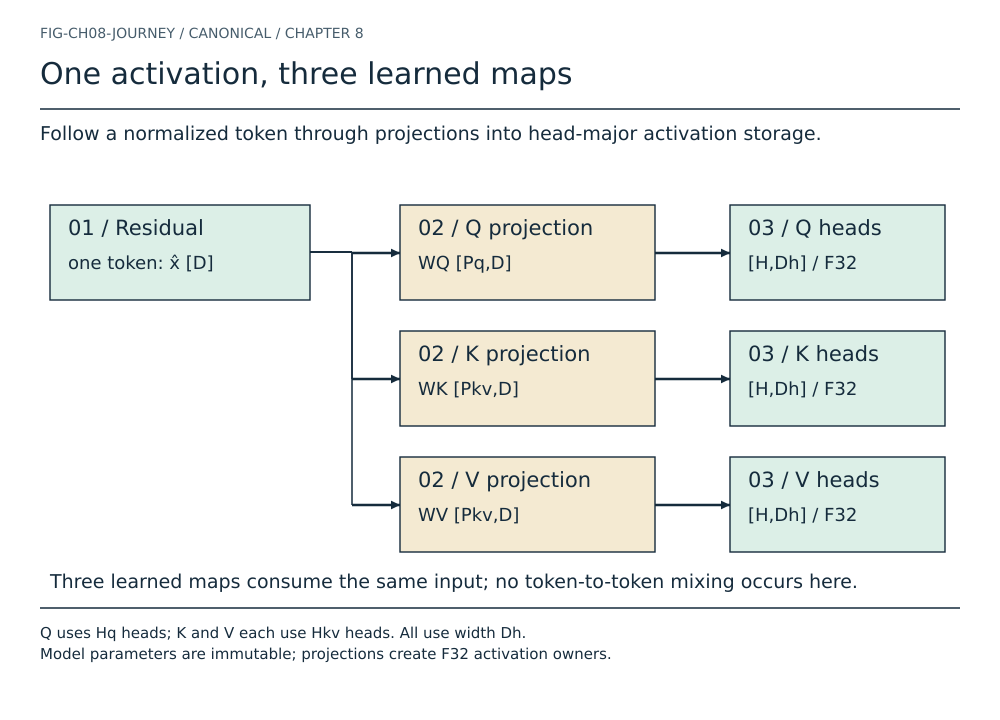
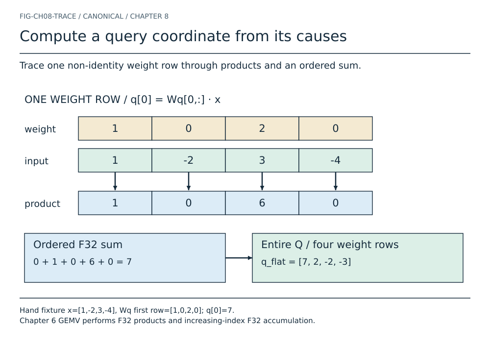
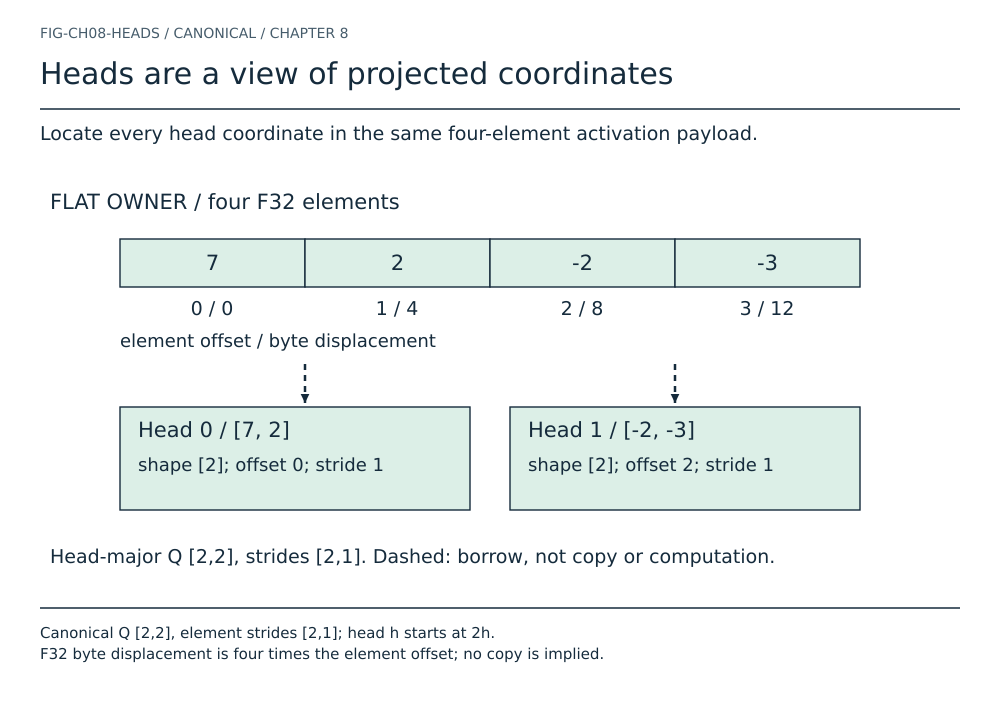
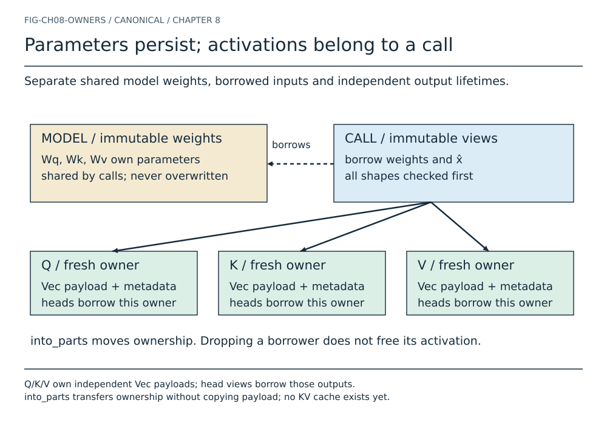
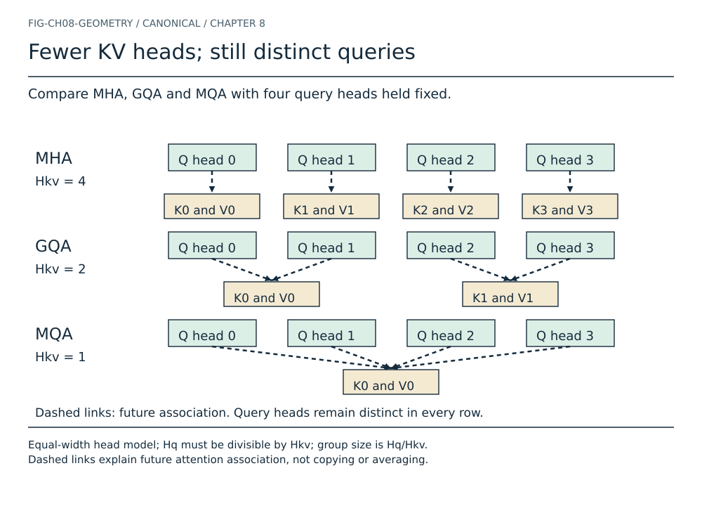
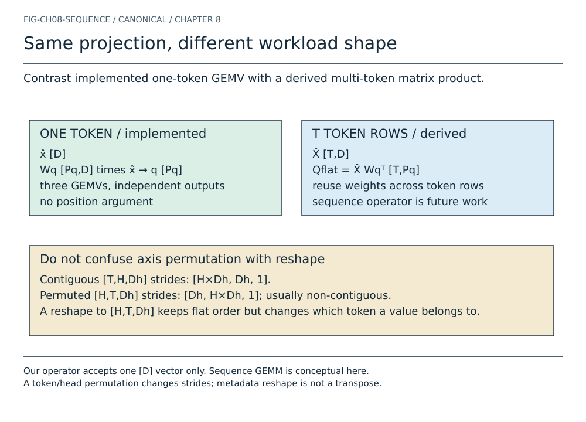
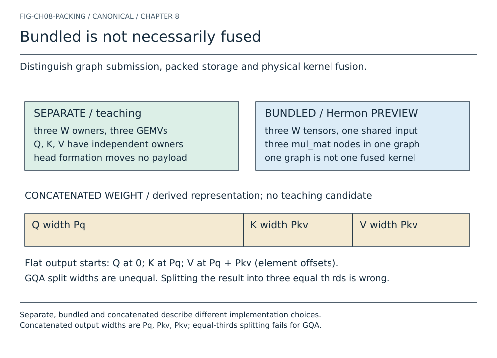
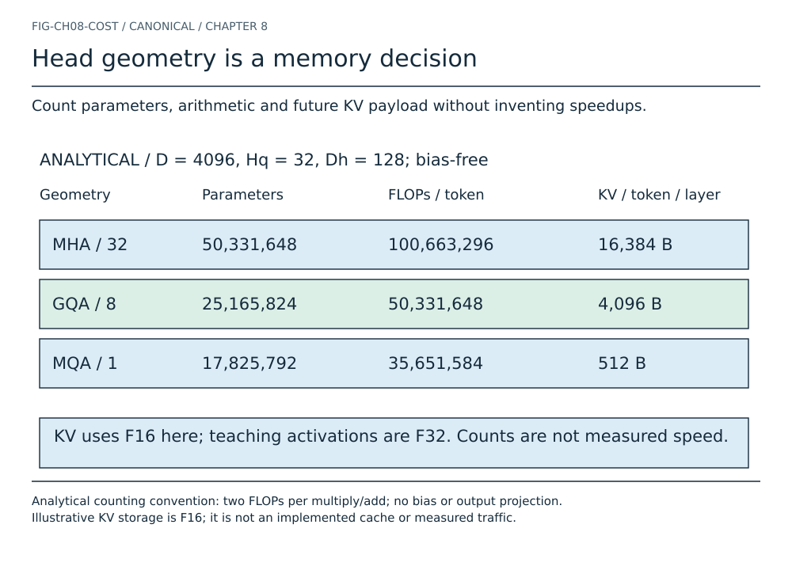
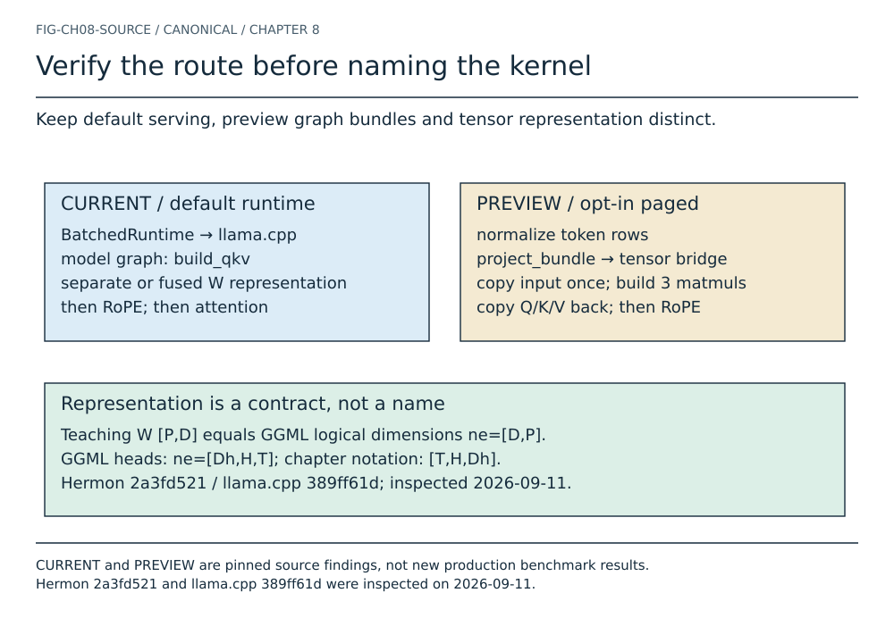
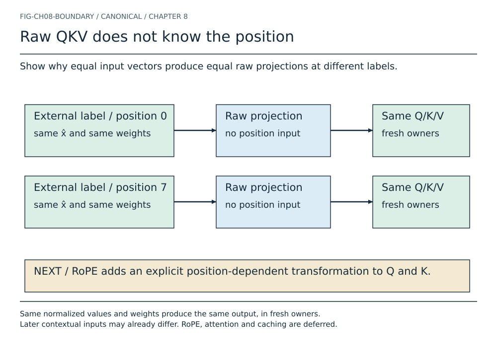

# Chapter 8 — Queries, Keys, and Values

You have loaded the weights, selected an embedding, and normalized a token's
residual vector. The next function returns three arrays. They have plausible
values, no bounds check fails, and their combined length matches the model
configuration. Yet the model's later attention results are wrong. The defect
is not necessarily in attention. Perhaps the implementation split a grouped
projection into equal thirds. Perhaps it interpreted a head-major array as
token-major. Perhaps a square weight matrix was silently transposed. Every
one of those mistakes can produce finite numbers of the expected total size.

This chapter makes that boundary inspectable. We will compute raw queries,
keys, and values from a normalized residual activation; identify every axis;
trace one output back to its weight row; and prove which allocation owns each
head. We will then explain why these small shape decisions become large
serving-memory decisions, without pretending that a shape formula is a speed
measurement or that three projections constitute an attention engine.

Our implementation is deliberately one-token, bias-free, safe Rust using
F32 storage and ordered F32 arithmetic. It composes Chapter 6's GEMV with
Chapter 5's tensor ownership. Chapter 7 supplies the activation that makes the
component pipeline executable. Position, attention, and persistent KV state
remain separate steps. A narrow implementation boundary allows a deep
explanation: the reader can test every claimed operation now.

## Three roles, not three database records



In decoder self-attention, each token supplies three kinds of vector. A query
will participate in deciding which available token information to read. A key
will participate in that comparison. A value will supply the information
combined under the resulting weights. Those are roles in a computation, not
human-readable records. A component of a query is not necessarily a question
word, a key is not a unique token identifier, and a value is not the original
embedding recovered unchanged.

The three vectors come from separately learned linear maps of the same
activation. The distinction between them is therefore both semantic and
physical: different parameter matrices normally yield different numbers, and
the next operators consume those numbers differently. The projection step
itself does not inspect another token. It neither chooses a source token nor
mixes information across a sequence. The original Transformer describes
separate learned projections per attention head; here we organize those
projections into full matrices so the engine can execute them efficiently.
[Vaswani et al., §3.2.2](https://arxiv.org/abs/1706.03762)

At the first layer, the residual may be the token embedding. At later layers,
it is the state produced by earlier blocks, potentially already influenced by
other tokens. Consequently, two occurrences of the same token ID need not have
equal Q/K/V in a real decoder. The precise invariant is narrower: **equal
input activations under equal projection weights produce equal raw outputs**.
Token identity alone does not establish equal activations.

> **FIRST PRINCIPLE**
> A projection gives a token a new numerical representation. Attention will
> determine how representations from different tokens interact. Do not assign
> the second operation's behavior to the first operation's name.

## Declare the geometry before touching the payload

Use $D$ for residual width, $H_q$ for query-head count, $H_{kv}$ for the number
of key heads and, separately, value heads, and $D_h$ for the width of one head.
The book's selected model uses the same head width for all three projections.
Define two flat output widths:

$$
P_Q=H_qD_h,\qquad P_{KV}=H_{kv}D_h.
$$

These are counts of scalar coordinates, not bytes. Our checked geometry
requires positive integer dimensions and

$$
D=H_qD_h,\qquad H_q\bmod H_{kv}=0,\qquad G=\frac{H_q}{H_{kv}}.
$$

Here $G$ is the number of query heads in each equal-sized KV group. These are
model choices, not mathematical requirements of every possible Transformer.
Other architectures can use different query projection widths, unequal
key/value widths, projection biases, or additional Q/K normalization. A
loader must identify the architecture before treating its configuration as
this contract. Accepting a tensor because it has a familiar name is not model
support.

Let $\widehat{\mathbf{x}}\in\mathbb{R}^{D}$ be one normalized residual, owned
by the caller. Use Chapter 6's semantic weight orientation: **output rows,
input columns**. The immutable model parameters are

$$
\mathbf{W}_Q\in\mathbb{R}^{P_Q\times D},\qquad
\mathbf{W}_K,\mathbf{W}_V\in\mathbb{R}^{P_{KV}\times D}.
$$

The flat activations are

$$
\begin{aligned}
\mathbf{q}_{\mathrm{flat}}&=\mathbf{W}_Q\widehat{\mathbf{x}}
    &&\in\mathbb{R}^{P_Q},\\
\mathbf{k}_{\mathrm{flat}}&=\mathbf{W}_K\widehat{\mathbf{x}}
    &&\in\mathbb{R}^{P_{KV}},\\
\mathbf{v}_{\mathrm{flat}}&=\mathbf{W}_V\widehat{\mathbf{x}}
    &&\in\mathbb{R}^{P_{KV}}.
\end{aligned}
$$

The contracted dimension is always $D$. Every output coordinate may depend on
every input coordinate. In particular, splitting a residual vector into
shorter pieces and applying a small matrix to each piece is generally **not**
multi-head projection. Heads partition the *projected output*, not the input
information available to each learned map.

For a generic projection matrix $\mathbf{W}\in\mathbb{R}^{P\times D}$,
the scalar meaning is

$$
y_i=\sum_{j=0}^{D-1}W_{i,j}\widehat{x}_j,
\qquad 0\le i<P.
$$

This equation is over real numbers. The implementation rounds products and
partial sums in F32, in increasing $j$ order. Storage dtype, accumulation
dtype, and reduction order are three separate parts of the contract. A
quantized matrix or fused hardware instruction may implement the same real
expression with different rounding and access rules.

## Calculate an output before building an abstraction



First use a diagnostic input $\mathbf{x}=[1,-2,3,-4]^{\mathsf T}$ directly.
It is not claimed to be the output of normalization. The operator accepts a
numeric vector of the correct shape; normalization belongs to its caller.
This distinction keeps the hand calculation exact. We will run the normalized
composition separately.

Choose $D=4$, $H_q=H_{kv}=2$, $D_h=2$, and non-identity weights:

$$
\mathbf{W}_Q=
\begin{bmatrix}
1&0&2&0\\0&1&0&-1\\1&1&1&1\\-1&0&0&\tfrac12
\end{bmatrix},\qquad
\mathbf{W}_K=
\begin{bmatrix}
0&1&1&0\\1&0&0&1\\1&-1&0&0\\0&0&\tfrac12&-\tfrac12
\end{bmatrix}.
$$

The value map is different again:

$$
\mathbf{W}_V=
\begin{bmatrix}
1&2&0&0\\0&0&1&1\\\tfrac12&0&0&0\\0&-1&0&1
\end{bmatrix}.
$$

For the first query coordinate, the matched-index products are
$[1,0,6,0]$. Their sum is $7$. For the second coordinate, the nonzero terms
are $-2$ and $4$, giving $2$. Repeating the same operation over each row gives

$$
\mathbf{q}_{\mathrm{flat}}=
\begin{bmatrix}7\\2\\-2\\-3\end{bmatrix},\qquad
\mathbf{k}_{\mathrm{flat}}=
\begin{bmatrix}1\\-3\\3\\\tfrac72\end{bmatrix},\qquad
\mathbf{v}_{\mathrm{flat}}=
\begin{bmatrix}-3\\-1\\\tfrac12\\-2\end{bmatrix}.
$$

No probability appears here. Negative coordinates are valid. The entries do
not sum to one, and an entry larger than one is not a normalization failure.
These vectors are learned features for later computation, not attention
weights and not vocabulary logits.

This fixture is useful precisely because an identity matrix would conceal
several defects. A transposition changes these nonsymmetric weights. A
projection-name swap changes the outputs. Treating query heads as input slices
loses the contribution of $x_2$ to $q_0$. Mixed signs catch a mistaken absolute
value; fractional entries exercise more than integer copying. The input-only
[fixture](../../code/reference/fixtures/chapter08-qkv.json) drives both the
Rust trace and the independent Python oracle; expected output arrays are not
stored as fixture inputs.

## A head is an indexed region, not another allocation



The next consumer wants a head axis. Regroup the query payload into
$\mathbf{Q}\in\mathbb{R}^{H_q\times D_h}$ and key/value payloads into
$\mathbf{K},\mathbf{V}\in\mathbb{R}^{H_{kv}\times D_h}$. For the query,

$$
Q_{h,j}=q_{\mathrm{flat},\,hD_h+j},
\qquad 0\le h<H_q,\quad 0\le j<D_h.
$$

The canonical head-major strides are $[D_h,1]$, measured in elements. If the
payload starts at byte address $b$, the address of $Q_{h,j}$ in this F32
representation is

$$
\operatorname{address}(Q_{h,j})=b+4(hD_h+j)\ \text{bytes}.
$$

The $4$ is the F32 storage width; it is not an inherent property of Q. Our
example's query heads are $[7,2]$ and $[-2,-3]$. Head 1 starts at element
offset 2, byte displacement 8. Its second coordinate is element 3, byte
displacement 12. Reshaping does not move these bytes or perform more products.
It changes metadata so a later operator can ask a better-shaped question.

There are two related operations in the code. After GEMV returns an owned
flat tensor, `into_vec` transfers its allocation to an owned tensor with
head-major metadata. Later, `query_head(h)` constructs an immutable rank-one
view with base offset $hD_h$. The first operation moves ownership; the second
borrows it. Neither operation copies the numerical payload. Small shape and
stride metadata may allocate; “no payload copy” is more precise than claiming
that the entire operation has zero allocation overhead.

Do not generalize this to arbitrary reshapes. Chapter 5 only permits a
metadata-only reshape of a canonical row-major view with an unchanged element
count. An arbitrary strided input may need materialization for a new layout.
Here the projection's output is canonical even if the input weights were
strided, so the head regrouping has a valid proof.

## Follow the owner across the operator boundary



A model can share immutable weights among requests. A normalized input belongs
to the current computation. The function borrows those operands, validates
their shapes, and produces three new activation owners. It has no reason to
retain a borrow of a weight after returning. The returned query head borrows
query activation storage, **not** the row of $\mathbf{W}_Q$ that produced it.
One is a computed result; the other is a parameter participating in a dot
product.

This distinction prevents an attractive but wrong “zero-copy” shortcut.
Returning a view into a weight matrix can implement an embedding lookup, but
it cannot implement a general learned projection: the output depends on all
the input values. Avoiding an output allocation requires another valid owner,
such as caller-provided workspace. It does not remove the need to compute and
store the result somewhere.

The teaching result keeps its fields private. Callers inspect them through
`query()`, `key()`, and `value()`, or transfer ownership through `into_parts()`
when a subsequent operator needs mutation rights. Head views cannot outlive
the owners they borrow. Rust also prevents consuming the result while a
borrow that is still used remains outstanding. Consuming the result is the
natural future boundary for position transformations, but this chapter does
not implement those transformations.

Projection is stateless across calls. There is no session table, request ID,
sequence position, or cache inside `QkvProjection`. Later serving code will
decide where activations are computed, which K/V state survives an iteration,
and when cancellation releases it. Today, dropping an activation owner frees
its storage after its borrows have ended. Teaching request-owned activations
does not imply that the eventual production runtime must allocate three fresh
heap buffers for every token.

## Multi-head, grouped-query, and multi-query geometry



Three common architectures fit the same projection interface:

- **MHA:** $H_{kv}=H_q$. Each query head has its own corresponding key head
  and value head.
- **GQA:** $1<H_{kv}<H_q$ with divisible grouping. Several query heads will
  use the same key head and the same value head.
- **MQA:** $H_{kv}=1$ and more than one query head. All query heads will use
  one key head and one value head.

MQA was proposed to reduce the repeated key/value memory demand of incremental
decoding. GQA generalizes the head-sharing choice between MQA and MHA. These
papers motivate the architecture; their reported speed and quality findings
are not benchmarks of this teaching engine.
[Shazeer](https://arxiv.org/abs/1911.02150),
[Ainslie et al.](https://arxiv.org/abs/2305.13245)

For the equal contiguous grouping convention illustrated above, a future
attention operator associates query head $h$ with

$$
g(h)=\left\lfloor\frac{h}{G}\right\rfloor,
\qquad G=H_q/H_{kv}.
$$

With four query heads and two KV heads, queries 0 and 1 associate with KV head
0; queries 2 and 3 associate with KV head 1. This equation defines an
association, not a projection kernel. Our API validates the geometry and
reports group size, but does not execute attention matching. Other storage
arrangements may reorder heads, requiring a corresponding mapping.

Sharing does not mean averaging query vectors. It does not mean computing
$H_q$ key heads and then discarding most of them. The key and value projection
matrices themselves have fewer output rows. Each remaining row still reduces
over all $D$ input coordinates. Nor does sharing make the query heads
identical: their different weight rows remain intact.

A concrete GQA configuration with $D=8$, $H_q=4$, $H_{kv}=2$, $D_h=2$ has
$\mathbf{W}_Q$ of shape $[8,8]$, but $\mathbf{W}_K$ and $\mathbf{W}_V$ of
shape $[4,8]$. Its output shapes are $[4,2]$, $[2,2]$, and $[2,2]$.
Allocating K and V as $[4,2]$ would be a semantic error even if oversized
buffers avoided an immediate memory fault. A loader that validates only the
query shape misses exactly this class of bug.

Changing head count is not a free deployment toggle. A checkpoint trained
with independent KV projections contains different learned parameters from a
checkpoint with shared KV projections. Converting one to the other needs an
explicit model transformation and quality validation. Shape compatibility
cannot establish functional equivalence.

## Implement semantics above the numerical kernel

The complete implementation is in [qkv.rs](../../code/mini-engine/crates/engine0/src/qkv.rs).
Its public entry point has five inputs:

```rust
pub fn project_qkv_reference(
    config: QkvConfig,
    input: &TensorView<'_>,
    query_weight: &TensorView<'_>,
    key_weight: &TensorView<'_>,
    value_weight: &TensorView<'_>,
) -> Result<QkvProjection, QkvError>
```

`QkvConfig::try_new(D, Hq, Hkv, Dh)` rejects zero dimensions, checks both
head-width products for integer overflow, verifies $D=H_qD_h$, and checks
divisibility. Private fields prevent constructing an invalid configuration
through a public struct literal. Computing a product and only then checking
the result is too late: in a release build the overflowing product could have
wrapped into a plausible smaller dimension.

The projection function verifies the exact input shape and each of the three
weight shapes **before any GEMV runs**. Shape errors name the operand and
report expected and actual dimensions. Rank is part of shape: $[1,D]$ is not
silently accepted as $[D]$. This prevents a hidden batch-axis convention from
entering the operator through an apparently harmless convenience.

Once validated, each weight view goes through `gemv_reference`. That is the
only numerical reduction. The QKV module does not copy GEMV into a new loop,
add an untested “fast” path, or reinterpret strides as contiguous storage.
Validated strided inputs, independently strided matrices, and immutable
zero-stride broadcast views inherit the existing kernel's semantics.

The result construction transfers GEMV's flat allocation into $[H,D_h]$
metadata. Head access checks $h<H$ before calculating its base offset. This
order matters for a supplied index of `usize::MAX`: bounds rejection must
precede multiplication. The validated owner proves that an accepted offset
lies inside the payload. No unsafe pointer arithmetic is needed.

The numerical error contract deserves equal precision. Chapter 7's RMSNorm
explicitly rejects selected non-finite intermediates. Chapter 6's generic
GEMV follows IEEE propagation, so the QKV wrapper can return `Ok` containing
infinity or NaN. For example, a finite F32 maximum weight times input 3
overflows. A NaN input can contaminate a result even when the corresponding
weight is zero. Shape validity is not numerical validity. Tests retain this
behavior instead of suggesting that QKV has acquired an unimplemented
finite-value gate. Later model-level diagnostics can choose an explicit
policy for rejecting non-finite activations.

Likewise, typed errors do not make this a production resource-admission API.
Allocation follows the existing `Vec`/GEMV behavior; allocator exhaustion is
not a recoverable `QkvError`. A serving runtime needs bounded workspace,
admission accounting, and failure policy above the operator. Keeping that
limit visible is part of teaching an honest systems boundary.

## Compose embedding, normalization, projection, and head access

The executable trace uses Chapter 7's three-row embedding table. Token 1
selects $[1,-2,3,-4]$, and the learned RMSNorm gain is
$[1,\tfrac12,2,-1]$ with $\epsilon=10^{-5}$. The normalization denominator
uses mean square $7.5$. Its output, rounded here for display, is

$$
\widehat{\mathbf{x}}\approx
\begin{bmatrix}
0.365148\\-0.365148\\2.190889\\1.460593
\end{bmatrix}.
$$

Applying the same three weight matrices as before now gives

$$
\begin{aligned}
\mathbf{Q}&\approx
\begin{bmatrix}4.746926&-1.825741\\3.651481&0.365148\end{bmatrix},\\
\mathbf{K}&\approx
\begin{bmatrix}1.825741&1.825741\\0.730296&0.365148\end{bmatrix},\\
\mathbf{V}&\approx
\begin{bmatrix}-0.365148&3.651481\\0.182574&1.825741\end{bmatrix}.
\end{aligned}
$$

Query head 1 borrows the last two query coordinates,
$[3.651481,0.365148]$. The raw hand fixture and this normalized composition
are different experiments. A diagram that normalizes its input but prints
the raw fixture's output would be attractive and wrong. The parity check
compares both complete sets of outputs, the normalized intermediate, every
flat offset, and the borrowed head against the independent oracle.

Run from the repository root:

```bash
cd code/mini-engine
cargo run --quiet --example chapter08_qkv_trace
cargo test --test qkv
cd ../..
python3 code/reference/python/chapter08_qkv_oracle.py
python3 scripts/check-qkv-visual-parity.py
```

The Python oracle uses `math.fsum` over row products and groups the resulting
Python list into heads. It does not call Rust, reuse the tensor indexing
implementation, or reproduce the F32 accumulator. Comparison uses
$|a-b|\le 10^{-5}+10^{-5}|b|$ for these small composed fixtures, with a
finite-value requirement. This is a fixture tolerance, not a universal error
bound for arbitrary width or ill-conditioned reductions. The exact
integer/half-valued raw fixture is also checked for exact equality.

## A sequence adds an axis; it does not change the learned map



For $T$ normalized token rows,
$\widehat{\mathbf{X}}\in\mathbb{R}^{T\times D}$, the mathematical query
projection is

$$
\mathbf{Q}_{\mathrm{flat}}=
\widehat{\mathbf{X}}\mathbf{W}_Q^{\mathsf T}
\in\mathbb{R}^{T\times P_Q}.
$$

The transpose in the equation follows from our weight orientation; it is not
an instruction to allocate and transpose the weight payload on every call.
A kernel can accept layout metadata or a transpose flag, or a loader can
prepare a persistent execution layout. The best representation depends on
the backend. The logical contraction remains over $D$.

Canonical token-major query heads have shape $[T,H_q,D_h]$ and element
strides $[H_qD_h,D_h,1]$. Thus

$$
\operatorname{offset}(t,h,j)=tH_qD_h+hD_h+j.
$$

An operator expecting head-major sequence access may prefer $[H_q,T,D_h]$.
Permuting axes preserves coordinate meaning but changes strides to
$[D_h,H_qD_h,1]$. Merely reshaping the same flat storage to that shape keeps
flat order while assigning values to different token/head coordinates. For
$T=2$, $H_q=2$, $D_h=2$, original coordinate $(t=0,h=1,j=0)$ has offset 2;
the correctly permuted coordinate $(h=1,t=0,j=0)$ must still have offset 2.
A canonical reshape would assign it offset 4. Total element count alone
cannot catch the mistake.

During one-token decode a layer computes a small number of token rows, often
one per active sequence. During prefill it may process many prompt rows.
Projection has no cross-token dependence, so rows can be computed together.
This creates an opportunity to reuse weights and amortize setup. It does not
make the entire prefill graph unconstrained: later causal attention still
has its own visibility contract. Nor is a decode batch necessarily one row;
multiple active requests can supply a matrix workload. The useful kernel
question is “how many rows are available now?”, not merely “is this called
decode?”

These are shape derivations and workload implications. The new teaching API
still accepts one vector. We do not conceal a sequence operator, batching
runtime, or attention implementation inside the diagram.

## Separate, bundled, packed, and fused mean different things



The transparent implementation uses separate matrices and three GEMV calls.
An execution graph can instead submit three matrix products sharing one input
node. That is a **bundle**. It may avoid repeated input preparation or graph
setup, but it still contains three mathematical products. A graph scheduler
can execute those products through several kernel launches. One graph is not
evidence of one fused kernel.

A different transformation concatenates the weight rows:

$$
\mathbf{W}_{QKV}=
\begin{bmatrix}\mathbf{W}_Q\\\mathbf{W}_K\\\mathbf{W}_V\end{bmatrix}
\in\mathbb{R}^{(P_Q+2P_{KV})\times D}.
$$

One projection then produces a combined activation. With this specific
concatenation order, its half-open element intervals are

$$
\begin{aligned}
Q&:[0,P_Q),\\
K&:[P_Q,P_Q+P_{KV}),\\
V&:[P_Q+P_{KV},P_Q+2P_{KV}).
\end{aligned}
$$

The intervals are equal only when $P_Q=P_{KV}$. In the $D=8$ GQA example,
the combined output has 16 elements split into 8, 4, and 4. An equal-thirds
helper is wrong before any attention arithmetic starts. Other formats may
interleave heads instead of concatenating Q then K then V, so even these
offsets are a representation-specific contract.

“Packed” can also refer to a backend-specific matrix layout or quantization
blocks, not QKV concatenation at all. Loading several separate quantized
weights into one graph is a bundled packed-weight path without a single
concatenated QKV parameter. Engineers need to ask what is packed, which owner
holds it, and which operation interprets the layout.

Fusion has lifetime consequences. Three separate outputs can be independently
released. Three views into one combined activation keep that shared
allocation alive until the last required region is no longer needed, unless
a consumer copies or transfers regions under another storage design. A
single allocation can reduce setup overhead but extend live memory. A valid
optimization must preserve semantic outputs, aliasing rules, downstream
layout requirements, and failure behavior—not only the matrix equation.

## Count the cost that serving must eventually pay



Count one multiplication and one addition per loop contribution, including
the addition to an initially zero accumulator. Under this convention,

$$
N_{\mathrm{parameters}}=D(P_Q+2P_{KV}),\qquad
F_{QKV}=2D(P_Q+2P_{KV})\ \text{FLOPs/token/layer}.
$$

There is no bias or attention output projection in these counts. They count
algorithmic arithmetic, not machine instructions; an FMA instruction can
represent two FLOPs. With MHA and our $P_Q=D$ constraint, the expressions
become $3D^2$ parameters and $6D^2$ FLOPs per token per layer.

At fixed $D,H_q,D_h$, the fraction of the MHA projection parameter budget is

$$
\frac{N_{QKV}(H_{kv})}{N_{QKV}(H_q)}
=\frac{1+2H_{kv}/H_q}{3}.
$$

Reducing KV heads fourfold therefore does **not** reduce QKV parameters
fourfold. The query projection remains. With $D=4096$, $H_q=32$,
$D_h=128$, reducing $H_{kv}$ from 32 to 8 halves QKV parameters, from
50,331,648 to 25,165,824. Reducing it to 1 gives 17,825,792, not one
thirty-second of the original. This is a useful example of why an optimization
must be costed against the component it actually changes.

### Logical accesses are not memory-bus traffic

Let $S=P_Q+2P_{KV}$. For separate F32 weights and outputs, a minimal unique
payload accounting for one token is

$$
B_{\mathrm{unique}}=4(DS+D+S)\ \text{bytes}.
$$

This counts each weight once, one input vector, and one output write per
coordinate. It is not a claim that the scalar loop performs only $D$ input
loads. Our GEMV expresses an input access for every weight contribution, so
across all three products it expresses $DS$ weight accesses and $DS$ input
accesses. It writes $S$ output coordinates after reduction. Ignoring output
zero-initialization and metadata, that source-level operand accounting is
$4(2DS+S)$ bytes. Caches and compiler transformations can satisfy many input
accesses without a memory-bus transfer. Conversely, allocation, cache-line
granularity, write allocation, packing, and device copies can add traffic.

In a weight-dominated one-row F32 model, the ideal arithmetic intensity
$2DS/(4DS)$ approaches $0.5$ FLOPs/byte. For $T$ rows sharing one weight
read, an idealized payload model is

$$
I(T)=\frac{2TDS}{4(DS+TD+TS)}\ \text{FLOPs/byte}.
$$

This predicts the *opportunity* for reuse, not the attained throughput.
Weights may already be cached, may not fit in cache, may be quantized, or may
be read repeatedly by a poorly tiled kernel. A bandwidth/compute lower bound
must use bytes and attainable rates for the same memory level and execution
path. Graph setup, launches, synchronization, queueing, and later operators
remain outside that isolated bound. None of these equations establishes
time-to-first-token or an end-to-end speedup.

### The future KV footprint explains an architecture choice

Suppose later chapters retain both keys and values for $T$ tokens across $L$
layers, with $s$ storage bytes per scalar and the same geometry in every
layer. The payload alone is

$$
B_{KV}=2LTH_{kv}D_hs\ \text{bytes}.
$$

This is a **future dense-cache model**, not an implemented cache. It excludes
page metadata, alignment waste, allocator slack, replication, temporary
workspace, and other model state. With $L=32$, $T=8192$, $D_h=128$, and
F16 storage ($s=2$), $H_{kv}=32$ needs 4 GiB of K/V payload; eight KV heads
need 1 GiB; one KV head needs 128 MiB. The runtime still has to store model
weights and execute the request. Fewer KV heads do not guarantee those many
times more concurrent users.

The formula nevertheless gives a serving engineer a direct chain of
reasoning: checkpoint geometry determines per-token KV payload; retained
context and layers determine request-state size; available memory and
workspace policy constrain admission. The projection chapter has not built
that scheduler, but it has supplied the dimensions the scheduler must count.

## Inside Hermon: inspect the route, then the representation



The source inspection for this chapter pins Hermon to
`2a3fd5214e17ca7283656108847d02dcd6cdf7c5` and its llama.cpp submodule to
`389ff61d77b5c71cec0cf92fe4e5d01ace80b797`, inspected on 2026-09-11.
The [research record](../../research/part-02/chapter-08-queries-keys-and-values.md)
lists paths, claims, and deferred validation. These are source findings, not
a newly executed real-model benchmark.

> **INSIDE HERMON — CURRENT**
> An unset `HERMON_RUNTIME_MODE` selects `Batched`. That route constructs a
> `BatchedRuntime` around llama.cpp. Finding a Rust QKV-related component does
> not establish that the default serving request executes it.

In the pinned llama.cpp Llama graph, layer normalization precedes
`build_qkv`; RoPE follows Q/K projection, and attention follows that. The
graph helper supports separate Q/K/V weights and a combined QKV weight, with
architecture-specific bias and clamp handling. The separate results become
three reshaped tensors; the combined result becomes three offset views.
The production graph is more general than the teaching model.

The dimension spelling also changes. GGML lists the fastest-varying dimension
first: a semantic weight $[P,D]$ appears with dimensions `ne=[D,P]`, and
token-major heads $[T,H,D_h]$ appear as `ne=[Dh,H,T]`. This difference is a
notation and layout-interface issue, not evidence that the mathematics has
been transposed. Inspect strides and the multiplication convention together.
For quantized tensors, block layout prevents treating the payload as an
ordinary F32 array even if the logical shape is familiar.

> **INSIDE HERMON — PREVIEW / LIBRARY**
> `GgufLlamaForward` validates separate attention projection tensor geometry,
> normalizes token rows, and submits the three projection names together
> through `project_bundle`. The reusable tensor bridge copies the shared
> F32 input once, builds three `ggml_mul_mat` nodes in one graph, computes
> them, and copies separate results back to caller-owned output vectors.

This bundle amortizes a particular preparation boundary. It does not prove
that weight data is concatenated, that the backend uses one fused kernel, or
that every model/device path benefits. The preview later applies RoPE and
writes K/V into its cache, but those are distinct subsequent operations.
The native bridge test contains a sequential-versus-bundled equivalence
check; we inspected that test rather than claiming it was run with a model
artifact during this chapter's validation.

The useful industrial lesson is the separation of responsibilities. Model
semantics name Q, K, V, head counts, and the ordering of transformations.
Generic matrix operations carry typed operands to a backend. The backend
selects physical execution under dtype, layout, shape, and device constraints.
The serving layer governs when requests contribute rows and which state
survives. A correct inference engine needs all four contracts, not a single
box labeled “attention.”

## Prove failure behavior, not only the happy-path numbers

The [Rust test suite](../../code/mini-engine/crates/engine0/tests/qkv.rs)
checks the exact hand fixture, standard and non-power-of-two dimensions,
single-coordinate heads, MHA/MQA/GQA shapes, each zero dimension, both product
overflows, model-width mismatch, and invalid grouping. Each weight operand
independently receives wrong-rank and wrong-width cases. GQA explicitly
rejects a mistakenly full-width KV matrix.

Layout tests construct padded input and three differently strided weight
views, then compare with the canonical result. A broadcast-view case proves
that zero strides are legitimate for immutable inputs. Head tests verify
first, middle, and last head coordinates and compare borrowed addresses with
the corresponding owner cells. Indices equal to head count and `usize::MAX`
must fail. Mutation after ownership transfer must leave weights, input, and
the other output owners unchanged.

Several failures deserve deliberate reproduction:

- **Square-matrix transpose:** shapes still agree. Use nonsymmetric weights
  and nonuniform inputs; compare values, not lengths.
- **Equal-thirds GQA split:** total size looks plausible. Check the named
  projection widths and their half-open intervals.
- **Head reshape mistaken for input partitioning:** every head loses access
  to some residual coordinates. Trace a nonzero off-block weight contribution.
- **Token/head axis confusion:** shape products agree but coordinates refer
  to another token. Check an explicit multi-axis offset before optimizing.
- **A fake zero-copy projection:** a result aliases parameters instead of
  computed activation storage. Check ownership and mutate only a transferred
  output in a controlled test.
- **Finite inputs assumed to guarantee finite output:** multiplication can
  overflow. Check the documented arithmetic policy separately from shapes.

There is no performance benchmark in this milestone because there is no new
optimized candidate. Analytical counts and deterministic correctness traces
are the appropriate evidence. When a bundled or packed candidate is added,
first prove all three outputs and head coordinates against the oracle; then
record model geometry, dtypes, layout, hardware, build, warmup, repetitions,
allocation policy, and timing boundaries. A faster wrong head map is not a
successful optimization.

## The position boundary and the next build



Label one call “position 0” and another “position 7,” but pass exactly the same
normalized activation and weights. The raw Q/K/V outputs are identical. The
position labels are outside the function. They cannot influence an operation
that never receives them. Each call still returns independent owners.

That is not evidence that a full decoder is position-blind. It identifies the
missing mechanism at this stage of the build. Chapter 9 will introduce an
explicit position-dependent rotation of Q and K, with a declared coordinate
pairing convention. It must preserve the current projection contract while
making the new dependency visible in equations, memory access, and tests.
Attention scores, scaling, masks, softmax, value aggregation, and persistent
KV management remain later responsibilities.

## Exercises: a projection you can explain and break

The [Chapter 8 lab sequence](../../labs/lab-39-qkv-projection-workbench.md)
contains Labs 39–48, with input fixtures, expected artifacts, deliberate
breaks, and cleanup. Use the existing code as a reference, not as an answer
that excuses drawing the indices yourself.

1. **CHECK:** Derive all twelve raw fixture outputs without running the code.
   For each query head, name the weight rows and input coordinates used.
2. **BUILD:** Implement checked head access using the owned output's shape,
   stride, and base offset. Demonstrate that the view aliases the activation.
3. **BREAK:** Give the GQA configuration full-width K/V weights. Record the
   named error; then explain why truncating the buffer would hide a model bug.
4. **CHECK:** Map $(t=0,h=1,j=0)$ through $[2,2,2]$ token-major and correctly
   permuted head-major metadata. Show why canonical reshape gives a different
   answer.
5. **BUILD:** Reproduce the embedding-to-normalization-to-QKV trace against
   the independent Python oracle. Report the maximum absolute error for every
   projection, not only one selected coordinate.
6. **EXTEND:** Design, but do not benchmark as if implemented, a combined
   activation owner with checked Q/K/V views. Specify how ownership changes
   when one consumer needs mutation while another retains a borrow.
7. **CHECK:** Recalculate the 8192-token KV payload for F32 and 16 layers.
   Explain why the result equals the F16, 32-layer example and what that
   equality does not imply about model quality or throughput.
8. **EXTEND:** Write an acceptance checklist for adding a packed candidate:
   named shapes, orientation, head order, rounding tolerance, aliasing,
   allocation failures, and an isolated measurement boundary.

## What this chapter has established

Q/K/V are separately learned projections of a token activation. Each output
coordinate contracts over the full residual width. Heads regroup projected
coordinates under explicit strides and ownership; they do not partition the
input or allocate a cache. MHA, GQA, and MQA change key/value output width
while retaining distinct query heads. Those dimensions determine both
projection work and the payload a future cache must retain.

The executable milestone now reaches checked raw head tensors, with an
independent oracle and reproducible failures. The production comparison shows
why semantic names, graph bundles, storage packing, and kernel fusion must
remain distinct. The next build adds position, not another unexplained box.

### Primary references and evidence

- Vaswani et al., [Attention Is All You Need](https://arxiv.org/abs/1706.03762).
  Projection and multi-head definitions; not a claim about this engine's speed.
- Shazeer, [Fast Transformer Decoding: One Write-Head is All You Need](https://arxiv.org/abs/1911.02150).
  Multi-query motivation and architecture.
- Ainslie et al., [GQA: Training Generalized Multi-Query Transformer Models
  from Multi-Head Checkpoints](https://arxiv.org/abs/2305.13245).
  Grouped-query architecture and checkpoint-conversion research.
- Pinned [Hermon and llama.cpp source record](../../research/part-02/chapter-08-queries-keys-and-values.md),
  including default-route gates, graph construction, bridge ownership, and tests.
- [Independent numerical oracle](../../code/reference/python/chapter08_qkv_oracle.py)
  and [visual/implementation parity gate](../../scripts/check-qkv-visual-parity.py).
